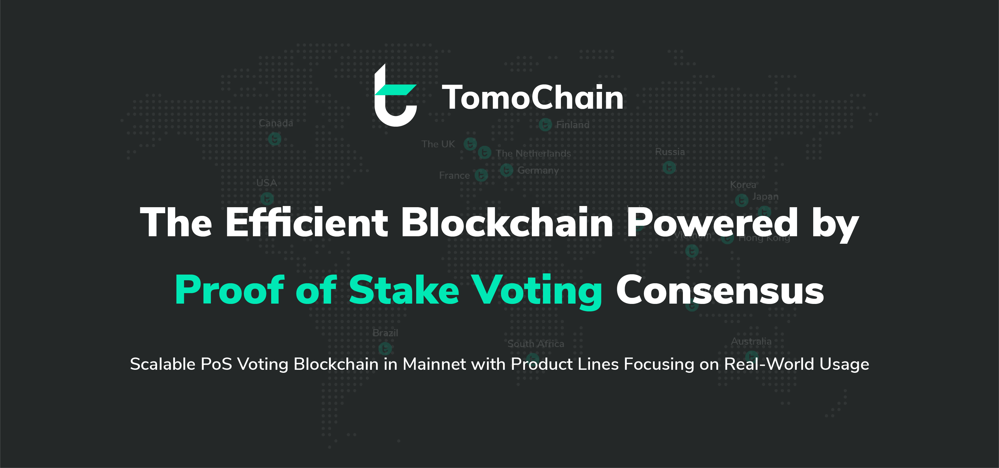

# Getting Started

* **For Voters/Stakers**: Staking on TomoChain Masternodes secures the network and earns rewards. More information can be in our guide on [how to connect wallets to TomoChain](https://docs.tomochain.com/get-started/wallet) and [how to vote](https://docs.tomochain.com/get-started/voting/).
* **For Masternode Owners**: 150 Masternodes work to secure the entire TomoChain ecosystem. Each Masternode is a server which uses its computing power to create and sign blocks. For this contribution, Masternodes receive rewards in the form of TOMO. A Masternode must satisfy [minimum system requirements](https://docs.tomochain.com/masternode/masternode-setup-guide/#technical-requirements-recommendations) in computing power, RAM, and storage to stably maintain the network. A financial requirement of 50,000 TOMO is needed to [apply](https://docs.tomochain.com/masternode/masternode-setup-guide/#11-apply-for-masternode-candidacy) to become a Masternode Candidate. Masternode owners should carefully read our dedicated guide to [running a Masternode](https://docs.tomochain.com/masternode/masternode-setup-guide), using [tmn](https://docs.tomochain.com/masternode/masternode-setup-guide/#6-installing-tmn-utility) and [Docker](https://docs.tomochain.com/masternode/masternode-setup-guide/#5-setup-docker-logged-in-as-new-user), along with our [tutorial](https://medium.com/tomochain/how-to-run-a-tomochain-masternode-from-a-to-z-3793752dc3d1) on the TomoChain Medium page and [wiki page](https://github.com/tomochain/docs/wiki).
* **For Developers**: To support the development of TomoChain's ecosystem growth, we are maintaining a set of tutorials and documents on developing Dapps to be run on TomoChain. This [Dapp tutorial](https://docs.tomochain.com/advance/dappdeploytuto/) shows how to deploy a smart contract on TomoChain. For developers who are curious about TomoChain's source code, this [private TomoChain testnet](https://docs.tomochain.com/advance/tutoprivatenet/) guides how to setup a private TomoChain testnet.

| **Documentation** | Description |
| :--- | :--- |
| [General ](general/) | Guidelines for getting started with TomoChain |
| [Masternode and DEX](masternode-and-dex/) | Step-by-step guide on how to run and vote for Masternodes and setup a DEX  |
| [Developer Guide](developer-guide/) | Guides to build Dapps and Services using TomoChain |
| [APIs](https://apidocs.tomochain.com%20) | This document explains how to use TomoChain APIs  |
| [Whitepaper and Research](whitepaper-and-research/) | Official Whitepaper documents and research papers on new technology developments |
| [Legal ](legal/) | Terms and conditions for the use of TomoChain technology |

