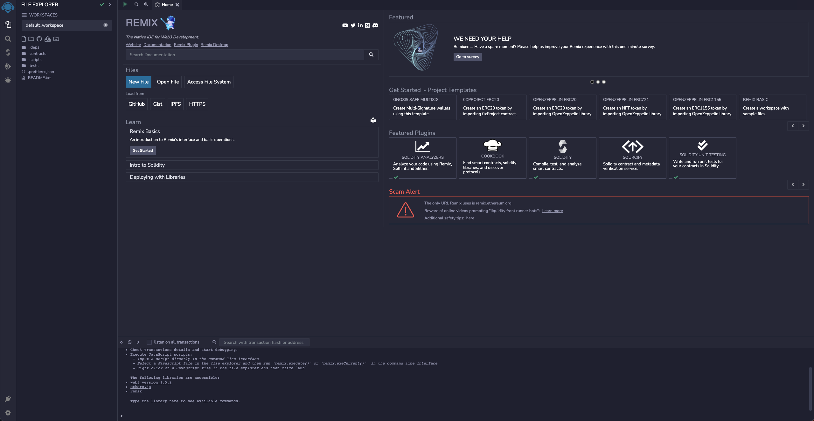

# Smart Contract using Remix

## Deploying a Smart Contract using Remix

[Remix](https://remix.ethereum.org/) is an online IDE that you can use to rapidly develop and deploy smart contracts. If you're new to smart contracts, it's a great tool that lets you jump right in without needing to configure a local editor or struggle through environment configuration issues before getting started.

Remix contains a simulation of a blockchain that you can use to rapidly deploy and test your contracts. This simulation only exists within your browser, so you can't share it with others or use external tools or a front end to interact with it. However, you can also deploy to a variety of testnets from within Remix. Doing so will allow you to share your contract with others, at the cost of making it public.

## **Objectives**

By the end of this lesson you should be able to:

* List the features, pros, and cons of using Remix as an IDE
* Deploy and test the Storage.sol demo contract in Remix
* Use Remix to deploy a contract to the Tomochain

## Remix UI Overview

Navigate to [https://remix.ethereum.org/](https://remix.ethereum.org/)

<figure><figcaption></figcaption></figure>

### Left Panel

<figure><figcaption></figcaption></figure>

The left panel in Remix has a number of vertical tabs that allow you to switch between different tools and functions. You can browse, add, delete file with file explorer in workspace.

### Remix Editor Panel

You can choose the code contract in the `contracts` folder on the left panel to display in the Editor. Here is the example of `1_Storage.sol` contract.

Remix editor can support you edit the solidity code directly. It also has most of the features you're expecting, such as syntax and error highlighting. Note that in Remix, errors are not underlines. Instead, you'll see an❗to the left of the line number where the error is present.

### Terminal

At the bottom of the editor panel

You can check the transaction logs or use the Remix tools with cli
