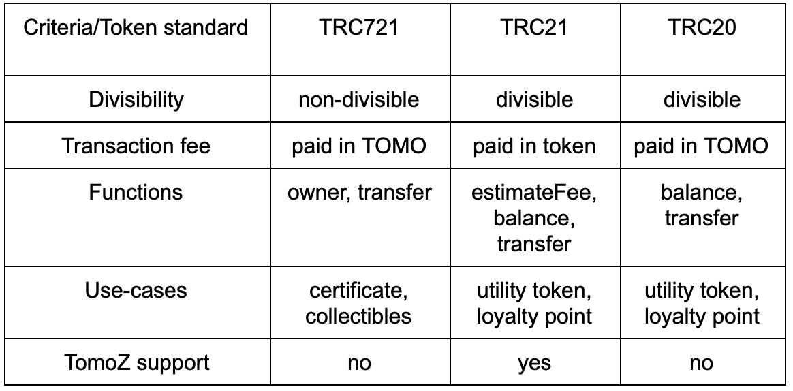

# An Overview of the Token Standards on TomoChain

### Overview 

In every blockchain ecosystem the token functions as the central element of a new type of economy. A token standard defines a set of rules that governs its issuance and use.

You may be familiar with ERC \(Ethereum Request for Comments\), which is a technical standard used for smart contracts on the Ethereum. This terminology is the origin of TRC tokens — the equivalent of ERC on TomoChain.

### **Fungible and Non-fungible token**

There are three token standards on TomoChain so far, each with their own unique function including TRC20, TRC21, and TRC721. These token standards can be divided into two different categories: **fungible and non-fungible tokens**. Fungible tokens are all equal and divisible**,** non-fungible tokens \(NFTs\) are all distinct and non-divisible.

Non-fungible tokens of the type TRC721 are those that represent a unique asset, like a certificate or a collectible in-game item. Fungible tokens are interchangeable and can be divided into smaller token units like TOMO. The fungible token standard includes TRC20 and TRC21 as digital assets used to offer access to products and/or services on a platform. The table below compares the differences between three types of token standards on TomoChain.

### **TRC20- the first token standard on TomoChain.**

The TRC20 standard is the most widely known token on TomoChain. The TRC20 token standard defines a list of basic functions and events that help developers to use standardized program functions which make these tokens transferable and usable. Transaction fees are paid through the native TOMO token.

[TriipMiles \(TIIM\)](https://ico.triip.me/) is a TRC20 token created by Triip Protocol, the first ICO on the TomoChain platform. TIIM can be used to reserve 28,859,813 listings including 5,539,347 homes, apartments and other unique places to stay at. Users get a 5% rebate on 137,678 destinations across 229 countries and territories. Developers who wants to know how to integrate TRC20 tokens to various applications \(e.g. wallets, exchanges\) should follow [this tutorial](https://docs.tomochain.com/developers/trc20-integrations/).

### **TRC21- fee by any token.**

TRC21 is the standard that goes along with TomoZ: Zero Friction protocol. This is an improvement upon the TRC20. Any token issued on TomoChain following this standard allows token holders to pay a fee for transactions to the token contract in terms of the token itself. Holders of this token can make transactions without the need of holding TOMO in the wallet for paying transaction fees. TomoIssuer is a tool that allows anyone to issue TRC21 tokens in minutes.

The release of the TomoZ protocol has launched a new era for the token economy, removing barriers to attract more mainstream users.

### **TRC721- Non-fungible token.**

Non-fungible tokens \(NFTs\) are all distinct and special. Every token is rare, with unique characteristics, its own metadata and special attributes. Most of the time when people think about NFT, they refer to the successful CryptoKitties game as the standard for crypto-collectibles. However, there are many other applications for TRC721 tokens. Please check our [other guide](https://medium.com/tomochain/how-to-deploy-nft-tokens-on-tomochain-fe476a68594d) about more use-cases for NFT and the process to deploy an NFT token on TomoChain

