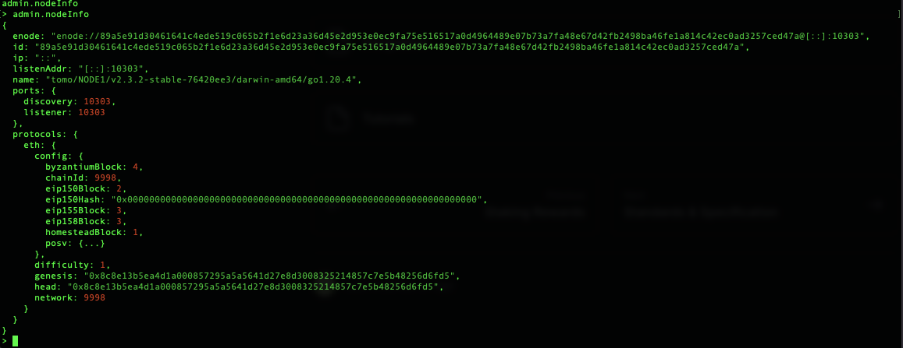
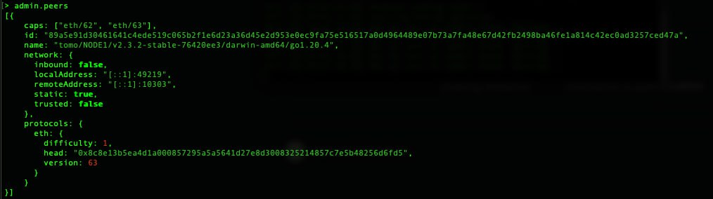

# TomoChain Private Testnet Setup

The following will walk you step-by-step to setup a TomoChain private net with four Masternodes.

### Setup environment <a href="#install-golang" id="install-golang"></a>

#### Install Golang

* Follow instruction here for your operating system: [https://go.dev/doc/install](https://go.dev/doc/install)


For MacOS running not Apple Silicon, please use amd64 variant of Golang instead of arm64.


* Set environment variables

```
set GOROOT=$HOME/usr/local/go
set GOPATH=$HOME/go
```

#### Build Tomo from source

* Create Tomo folder

```bash
mkdir $HOME/tomo
cd $HOME/tomo
```

* Download source code and build:

```
git init
git remote add git@github.com:tomochain/tomochain.git
git pull origin master
make all
```

* Download source code Tomo and install library:

```bash
git clone https://github.com/tomochain/tomochain
cd tomochain
go mod tidy -e
make all
cd ..
```

* Create alias for Tomo (this will only be effective in current session)

```bash
alias tomo=$PWD/tomochain/build/bin/tomo
alias puppeth=$PWD/tomochain/build/bin/puppeth
alias bootnode=$PWD/tomochain/build/bin/bootnode
```

### Setup Nodes and Accounts <a href="#setup-chain-data-folders-datadir-and-corresponding-keystore-folders-for-3-masternodes" id="setup-chain-data-folders-datadir-and-corresponding-keystore-folders-for-3-masternodes"></a>

* Create a file to store password to encrypt/decrypt private key in plain text:

```
echo [YOUR_PASSWORD] >> $HOME/tomo/password.txt
```

* You can either create new keypair or import private key for your node:



```bash
tomo account new --password $HOME/tomo/password.txt --datadir $HOME/tomo/node1
```



```bash
tomo account import [PATH_TO_YOUR_PRIVATE_KEY_FILE] --password $HOME/tomo/password.txt --datadir $HOME/tomo/node1
```



* Repeat the process for node2, node3 and node4.

### Customize genesis block using the `puppeth` tool

* Run puppeth command and answer questions about your private chain as follows:

```bash
puppeth
```

* Set chain name: `Tomo`
* Configure new genesis: `2`
* Select `POSV` consensus: `3`
* Set block time (default 2 seconds): `Enter`
* Set reward of each epoch: `250`
* Set addresses to be first masternode: Any address
* Set account to seal: Address of Node 1, Node 2, Node 3, Node 4
* Set the number of blocks of each epoch (default 900): `Enter`
* Set gap (How many blocks before checkpoint need to prepare new masternodes set ?): `5`
* Set foundation wallet address: `Enter`
* Account confirm Foundation MultiSignWallet: 2 or more addresses
* Require for confirm tx in Foundation MultiSignWallet: `1`
* Account confirm Team MultiSignWallet: 2 or more addresses
* Require for confirm tx in Team MultiSignWallet: `1`
* Enter swap wallet address for fund 55 million TOMO: Any address
* Enter account be pre-funded: Any address, should be at least 1
* Enter Network ID: Any number
* Export genesis file
  * Select `2. Manage existing genesis`
  * Select `2. Export genesis configuration`
  * Enter genesis filename (example): `$HOME/tomo/genesis.json`
* `Control + C` to exit

### Initialize Your Private Chain with Above Genesis Block <a href="#initialize-your-private-chain-with-above-genesis-block" id="initialize-your-private-chain-with-above-genesis-block"></a>

```bash
tomo init $HOME/tomo/genesis.json --datadir $HOME/tomo/node1
tomo init $HOME/tomo/genesis.json --datadir $HOME/tomo/node2
tomo init $HOME/tomo/genesis.json --datadir $HOME/tomo/node3
tomo init $HOME/tomo/genesis.json --datadir $HOME/tomo/node4
```

### Setup Bootnode <a href="#setup-bootnode" id="setup-bootnode"></a>

* Initialize bootnode key

```bash
bootnode -genkey bootnode.key
```

* Start bootnode and copy bootnode information

```bash
bootnode -nodekey ./bootnode.key
```

`enode://7e59324b1e54f8c282719465eb96786fb3a04a0265deee2cdb0f62e912337ca6f118d0c91f7ebfae6f5c17825205279249cf7ff65ae54d0a1a8908ef16f80f63@[::]:30301`

.png>)


As in this example, all nodes are running in the same machine, so the enode IP can be set to 127.0.0.1. From the above example: `enode://7e59324b1e54f8c282719465eb96786fb3a04a0265deee2cdb0f62e912337ca6f118d0c91f7ebfae6f5c17825205279249cf7ff65ae54d0a1a8908ef16f80f63@127.0.0.1:30301`


### Start Masternode <a href="#start-masternodes" id="start-masternodes"></a>

* Start Masternode 1

```bash
tomo --networkid [YOUR_NETWORK_ID] --identity "NODE1" \
     --rpc --rpcaddr 0.0.0.0 --rpcport 1545 --rpccorsdomain "*" --rpcvhosts "*" --rpcapi "db,debug,eth,net,personal,web3" \
     --ws --wsaddr 0.0.0.0 --wsport 1546 --wsorigins "*" \
     --syncmode "full" --gcmode "archive" --port 10303 --bootnodes [YOUR_BOOTNODE_INFORMATION] \
     --mine --password [YOUR_PASSWORD_FILE_TO_UNLOCK_YOUR_ACCOUNT] --unlock 0 \
     --datadir $HOME/tomo/node1 \
     console
```

* Start Masternode 2

```
tomo --networkid [YOUR_NETWORK_ID] --identity "NODE2" \
     --rpc --rpcaddr 0.0.0.0 --rpcport 2545 --rpccorsdomain "*" --rpcvhosts "*" --rpcapi "db,debug,eth,net,personal,web3" \
     --ws --wsaddr 0.0.0.0 --wsport 2546 --wsorigins "*" \
     --syncmode "full" --gcmode "archive" --port 20303 --bootnodes [YOUR_BOOTNODE_INFORMATION] \
     --mine --password [YOUR_PASSWORD_FILE_TO_UNLOCK_YOUR_ACCOUNT] --unlock 0 \
     --datadir $HOME/tomo/node2 \
     console
```

* Start Masternode 3

```
tomo --networkid [YOUR_NETWORK_ID] --identity "NODE3" \
     --rpc --rpcaddr 0.0.0.0 --rpcport 3545 --rpccorsdomain "*" --rpcvhosts "*" --rpcapi "db,debug,eth,net,personal,web3" \
     --ws --wsaddr 0.0.0.0 --wsport 3546 --wsorigins "*" \
     --syncmode "full" --gcmode "archive" --port 30303 --bootnodes [YOUR_BOOTNODE_INFORMATION] \
     --mine --password [YOUR_PASSWORD_FILE_TO_UNLOCK_YOUR_ACCOUNT] --unlock 0 \
     --datadir $HOME/tomo/node3 \
     console
```

* Start Masternode 4

```
tomo --networkid [YOUR_NETWORK_ID] --identity "NODE4" \
     --rpc --rpcaddr 0.0.0.0 --rpcport 4545 --rpccorsdomain "*" --rpcvhosts "*" --rpcapi "db,debug,eth,net,personal,web3" \
     --ws --wsaddr 0.0.0.0 --wsport 4546 --wsorigins "*" \
     --syncmode "full" --gcmode "archive" --port 40303 --bootnodes [YOUR_BOOTNODE_INFORMATION] \
     --mine --password [YOUR_PASSWORD_FILE_TO_UNLOCK_YOUR_ACCOUNT] --unlock 0 \
     --datadir $HOME/tomo/node4 \
     console
```

* Some explanations on the flags

```
--networkid: our testnet network ID.
--identity: your full-node's name.
--rpc, --rpcaddr, --rpcport, --rpccorsdomain, --rpcvhosts: your full-node will accept RPC requests at 8545 TCP.
--ws, --wsaddr, --wsport, --wsorigins: your full-node will accept Websocket requests at 8546 TCP.
--synmode: blockchain sync mode ("fast", "full", or "light". More detail: https://github.com/tomochain/tomochain/blob/master/eth/downloader/modes.go#L24)
--gcmode: blockchain garbage collection mode ("full", "archive")
--port: your full-node's listening port (default to 30303)
--bootnode: bootnode information to help to discover other nodes in the network
--mine: your full-node wants to register to be a candidate for masternode selection.
--password: your account's password.
--datadir: path to your data directory created above.
--verbosity: log level from 1 to 5. Here we're using 4 for debug messages
```

To see all flags usage

```
tomo --help
```

### Connect to other node manually

We'll try to let node2 to connect to node1.

#### Get node info

* Connect to node1 ipc

```
tomo attach $HOME/node1/tomo.ipc
```

* In the newly open prompt, run the following command:

```
admin.nodeInfo
```

<figure><figcaption></figcaption></figure>

As in the example, we can see `enode` information of node1. Copy this information for later use.

For example `enode://89a5e91d30461641c4ede519c065b2f1e6d23a36d45e2d953e0ec9fa75e516517a0d4964489e07b73a7fa48e67d42fb2498ba46fe1a814c42ec0ad3257ced47a@[::]:10303`


As in this example, all nodes are running in the same machine, so the enode IP can be set to 127.0.0.1. From the above example: `enode://89a5e91d30461641c4ede519c065b2f1e6d23a36d45e2d953e0ec9fa75e516517a0d4964489e07b73a7fa48e67d42fb2498ba46fe1a814c42ec0ad3257ced47a@127.0.0.1:10303`


* Exit node1 ipc prompt by this command:

```
quit
```

#### Add peer for your node

* Connect to node2 ipc

<pre><code><strong>tomo attach $HOME/node2/tomo.ipc
</strong></code></pre>

* In the newly open prompt, connect to other node by their enode (which we get from the previous step) using the following command:

```
admin.addPeer("enode://89a5e91d30461641c4ede519c065b2f1e6d23a36d45e2d953e0ec9fa75e516517a0d4964489e07b73a7fa48e67d42fb2498ba46fe1a814c42ec0ad3257ced47a@127.0.0.1:10303")
```

* Now check if we added peer sucessfully:

```
admin.peers
```

<figure><figcaption></figcaption></figure>

* Exit node2 ipc prompt by this command:

```
quit
```

* Repeat this step for other nodes.

### Check Your Private Chain <a href="#check-your-private-chain" id="check-your-private-chain"></a>

* Connect ipc

```
tomo attach $HOME/tomo/node1/tomo.ipc
```

```
admin.nodeInfo
eth.getBlock(0)
eth.getBlock(1)
```

* Connect rpc

```
tomo attach tomo attach http://localhost:1545
```

```
eth.getBlock(0)
eth.getBlock(1)
```

*   Verify Checkpoints

    ```
    Wait about 30 minutes to see if your chain passes the first checkpoint
    ```

.png>)

```
tomo attach http://0.0.0.0:1545
```

```
eth.getBlock(900)
```

### Troubleshooting <a href="#troubleshooting" id="troubleshooting"></a>

* Reset your chain

```
rm -rf $HOME/tomo/node1/tomo $HOME/tomo/node1/tomox
rm -rf $HOME/tomo/node2/tomo $HOME/tomo/node2/tomox
rm -rf $HOME/tomo/node3/tomo $HOME/tomo/node3/tomox
rm -rf $HOME/tomo/node4/tomo $HOME/tomo/node4/tomox
tomo init $HOME/tomo/genesis.json --datadir $HOME/tomo/node1
tomo init $HOME/tomo/genesis.json --datadir $HOME/tomo/node2
tomo init $HOME/tomo/genesis.json --datadir $HOME/tomo/node3
tomo init $HOME/tomo/genesis.json --datadir $HOME/tomo/node4
```

Note: we use the Gnosis Multisig Wallet: https://github.com/gnosis/MultiSigWallet
