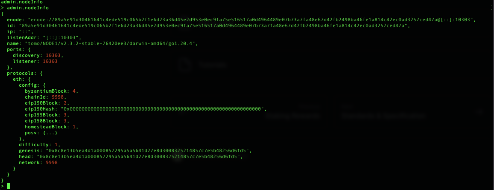
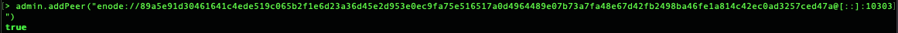

# TomoChain Private Testnet Setup

The following will walk you step-by-step to setup a TomoChain private net with three Masternodes.

## Install

### Golang <a href="#install-golang" id="install-golang"></a>

* Reference: [https://go.dev/doc/install](https://go.dev/doc/install)
* Install Golang:


MacOS - M series: amd64


```bash
curl -o golang.pkg https://dl.google.com/go/go1.20.4.darwin-amd64.pkg
sudo open golang.pkg
```

* Set environment variables (according to computer)

```bash
set GOROOT=$HOME/usr/local/go
set GOPATH=$HOME/go
```

### Tomo

* Create Tomo folder:

```bash
mkdir tomo
cd tomo
```

* Download source code Tomo and install library:

```bash
git clone https://github.com/tomochain/tomochain/
cd tomochain
go mod tidy -e
make all
cd ..
```

* Alias for Tomo:&#x20;

```bash
alias tomo=$PWD/tomochain/build/bin/tomo
alias puppeth=$PWD/tomochain/build/bin/puppeth
alias bootnode=$PWD/tomochain/build/bin/bootnode
```

## Setup Node and Account

* Create nodes folder:

```bash
mkdir nodes
cd nodes
mkdir 1
cd ..
```

* Create account or import account (with your private key):
  * Create a Keystore directory: `mkdir keystore`
  * Create a Password directory: `mkdir $HOME/pw`
  *   Create a New account:&#x20;

      * Create a new password file (example):&#x20;

      ```bash
      touch $PASSWORD_DIRECTORY/pw.txt
      echo [YOUR_PASSWORD] >> $PASSWORD_DIRECTORY/pw.txt
      ```

      * Create a new keystore file:

      ```bash
        tomo account new \
              --password $PASSWORD_DIRECTORY/pw.txt \
              --keystore $PWD/keystore/1
      ```
* Import account:&#x20;
  * Create a Private key directory: `mkdir $HOME/pk`
  * Export environment: `export PRIVATE_KEY_DIRECTORY=[DIRECTORY TO STORE PRIVATE KEY]`
  *   Create a Private key file (example):

      ```bash
      touch $PRIVATE_KEY_DIRECTORY/pk.txt
      echo [YOUR_PRIVATE_KEY] >> $PRIVATE_KEY_DIRECTORY/pk.txt
      ```
  *   Create a Tomo account with the private key file:

      <pre class="language-bash"><code class="lang-bash">tomo account import $PRIVATE_KEY_DIRECTORY/pk.txt \
          --keystore $PWD/keystore/1 \
      <strong>    --password $PRIVATE_KEY_DIRECTORY/pk1txt
      </strong></code></pre>
* Do the same things with Node 2, 3, 4

## Customize Genesis Block by Using the `puppeth` Tool <a href="#customize-genesis-block-by-using-the-puppeth-tool" id="customize-genesis-block-by-using-the-puppeth-tool"></a>

* Run puppeth command and answer questions about your private chain as follows:

```bash
puppeth
```

* Set chain name: `Tomo`
* Configure new genesis: `2`
* Select `POSV` consensus: `3`
* Set block time (default 2 seconds): `Enter`
* Set reward of each epoch: `250`
* Set addresses to be first masternodes: Account address of Node 1
* Set account to seal: Account address of Node 1, Node 2, Node 3, Node 4
* Set the number of blocks of each epoch (default 900): `Enter`
* Set gap (How many blocks before checkpoint need to prepare new masternodes set ?): `5`
* Set foundation wallet address: `Enter`
* Account confirm Foundation MultiSignWallet: Account address created before
* Require for confirm tx in Foundation MultiSignWallet: `1`
* Account confirm Team MultiSignWallet: Account address created before
* Require for confirm tx in Team MultiSignWallet: `1`
* Enter swap wallet address for fund 55 million TOMO
* Enter account be pre-funded
* Enter Network ID
* Export genesis file -&#x20;
  * Select `2. Manage existing genesis`&#x20;
  * Select `2. Export genesis configuration`&#x20;
  * Enter genesis filename (example): `genesis.json`
* `Control + C` to exit

## Initialize Your Private Chain with Above Genesis Block <a href="#initialize-your-private-chain-with-above-genesis-block" id="initialize-your-private-chain-with-above-genesis-block"></a>

```
tomo --datadir $HOME/tomochain/nodes/1 init genesis.json
tomo --datadir $HOME/tomochain/nodes/2 init genesis.json
tomo --datadir $HOME/tomochain/nodes/3 init genesis.json
```

## Setup Bootnode <a href="#setup-bootnode" id="setup-bootnode"></a>

* Initialize bootnode key

```bash
bootnode -genkey bootnode.key
```

* Start bootnode and copy bootnode information

```bash
bootnode -nodekey ./bootnode.key
```

.png>)

* Set BOOTNODE\_INFO environment: `"enode://372853cfc9cc509bdd79db961cf791e8b2c8fdbadd5b4a25b0e59187f3be9a6e1d26e381f8ed4ae71d81c72ad7f53430af605955293df66660232ad235633880@[::]:30301"`

## Run node


In a different terminal with bootnode


*   Set Password directory environment:

    `export PASSWORD_DIRECTORY=[DIRECTORY TO STORE PASSWORD OF KEYSTORE FILE]`
*   Set `tomo` command line:&#x20;

    `alias tomo=$PWD/tomochain/build/bin/tomo`
* Example address: `YOUR_ACCOUNT_ADDRESS=0x79d3620f9379d043eaea262f1cac689fc906d5a1`

### Start Masternodes <a href="#start-masternodes" id="start-masternodes"></a>

* Start Masternode 1

```
tomo --syncmode "full" \
--datadir nodes/1 --networkid 3172 --port 10303 \
--keystore keystore/1 --password $PASSWORD_DIRECTORY/pw.txt \
--rpc --rpccorsdomain "*" --rpcaddr 0.0.0.0 --rpcport 1545 --rpcvhosts "*" \
--rpcapi "admin,db,eth,net,web3,personal,debug" \
--gcmode "archive" \
--ws --wsaddr 0.0.0.0 --wsport 1546 --wsorigins "*" --unlock [YOUR_ACCOUNT_ADDRESS] \
--identity "NODE1" \
--mine --gasprice 2500 \ --bootnodesv5 [BOOTNODE_INFO] \
console
```

* Start Masternode 2

```
tomo --syncmode "full" \
--datadir nodes/1 --networkid 3172 --port 20303 \
--keystore keystore/1 --password $PASSWORD_DIRECTORY/pw.txt \
--rpc --rpccorsdomain "*" --rpcaddr 0.0.0.0 --rpcport 2545 --rpcvhosts "*" \
--rpcapi "admin,db,eth,net,web3,personal,debug" \
--gcmode "archive" \
--ws --wsaddr 0.0.0.0 --wsport 2546 --wsorigins "*" --unlock [YOUR_ACCOUNT_ADDRESS] \
--identity "NODE1" \
--mine --gasprice 2500 \ --bootnodesv5 [BOOTNODE_INFO] \
console
```

* Start Masternode 3

```
tomo --syncmode "full" \
--datadir nodes/1 --networkid 3172 --port 30303 \
--keystore keystore/1 --password $PASSWORD_DIRECTORY/pw.txt \
--rpc --rpccorsdomain "*" --rpcaddr 0.0.0.0 --rpcport 3545 --rpcvhosts "*" \
--rpcapi "admin,db,eth,net,web3,personal,debug" \
--gcmode "archive" \
--ws --wsaddr 0.0.0.0 --wsport 3546 --wsorigins "*" --unlock [YOUR_ACCOUNT_ADDRESS] \
--identity "NODE1" \
--mine --gasprice 2500 \ --bootnodesv5 [BOOTNODE_INFO] \
console
```

* Start Masternode 4

```
tomo --syncmode "full" \
--datadir nodes/1 --networkid 3172 --port 40303 \
--keystore keystore/1 --password $PASSWORD_DIRECTORY/pw.txt \
--rpc --rpccorsdomain "*" --rpcaddr 0.0.0.0 --rpcport 4545 --rpcvhosts "*" \
--rpcapi "admin,db,eth,net,web3,personal,debug" \
--gcmode "archive" \
--ws --wsaddr 0.0.0.0 --wsport 4546 --wsorigins "*" --unlock [YOUR_ACCOUNT_ADDRESS] \
--identity "NODE1" \
--mine --gasprice 2500 \ --bootnodesv5 [BOOTNODE_INFO] \
console
```

* Some explanations on the flags

```
--verbosity: log level from 1 to 5. Here we're using 4 for debug messages
--datadir: path to your data directory created above.
--keystore: path to your account's keystore created above.
--identity: your full-node's name.
--password: your account's password.
--networkid: our testnet network ID.
--port: your full-node's listening port (default to 30303)
--rpc, --rpccorsdomain, --rpcaddr, --rpcport, --rpcvhosts: your full-node will accept RPC requests at 8545 TCP.
--ws, --wsaddr, --wsport, --wsorigins: your full-node will accept Websocket requests at 8546 TCP.
--mine: your full-node wants to register to be a candidate for masternode selection.
--gasprice: Minimal gas price to accept for mining a transaction.
--targetgaslimit: Target gas limit sets the artificial target gas floor for the blocks to mine (default: 4712388)
--bootnode: bootnode information to help to discover other nodes in the network
--gcmode: blockchain garbage collection mode ("full", "archive")
--synmode: blockchain sync mode ("fast", "full", or "light". More detail: https://github.com/tomochain/tomochain/blob/master/eth/downloader/modes.go#L24)
```

To see all flags usage

```
tomo --help
```

### Connect Masternode to chain

* Open new terminal
* Connect to Masternode 1:

```bash
tomo attach nodes/1/tomo.ipc
```

* Get Node 1 info:

```bash
admin.nodeInfo
```

<figure><figcaption><p>Node 1 Info</p></figcaption></figure>

* We get enode id of masternode 1
* Example: `enode://89a5e91d30461641c4ede519c065b2f1e6d23a36d45e2d953e0ec9fa75e516517a0d4964489e07b73a7fa48e67d42fb2498ba46fe1a814c42ec0ad3257ced47a@[::]:10303`
* Open new terminal
* Connect to Masternode 2

```bash
tomo attach nodes/2/tomo.ipc
```

* Add node 1 peer to node 2

```bash
admin.addPeer("enode://89a5e91d30461641c4ede519c065b2f1e6d23a36d45e2d953e0ec9fa75e516517a0d4964489e07b73a7fa48e67d42fb2498ba46fe1a814c42ec0ad3257ced47a@[::]:10303")
```

<figure><figcaption></figcaption></figure>

* Checking adding peer sucessful:

```bash
admin.peers
```

<figure><figcaption><p>Success adding</p></figcaption></figure>

* Do same things with node 3, 4

## Check Your Private Chain <a href="#check-your-private-chain" id="check-your-private-chain"></a>

* Connect ipc

```bash
tomo attach nodes/1/tomo.ipc
```

```bash
admin.nodeInfo
eth.getBlock(0)
eth.getBlock(1)
```

* Connect rpc

```bash
tomo attach tomo attach http://localhost:1545
```

```bash
eth.getBlock(0)
eth.getBlock(1)
```

*   Verify Checkpoints

    ```
    Wait about 30 minutes to see if your chain passes the first checkpoint
    ```

.png>)

```bash
tomo attach http://0.0.0.0:1545
```

```bash
eth.getBlock(900)
```

## Troubleshooting <a href="#troubleshooting" id="troubleshooting"></a>

* Reset your chain

```bash
rm -rf nodes/1/tomo nodes/2/tomo  nodes/3/tomo
tomo --datadir nodes/1 init genesis.json
tomo --datadir nodes/2 init genesis.json
tomo --datadir nodes/3 init genesis.json
```

Note: we use the Gnosis Multisig Wallet: https://github.com/gnosis/MultiSigWallet
