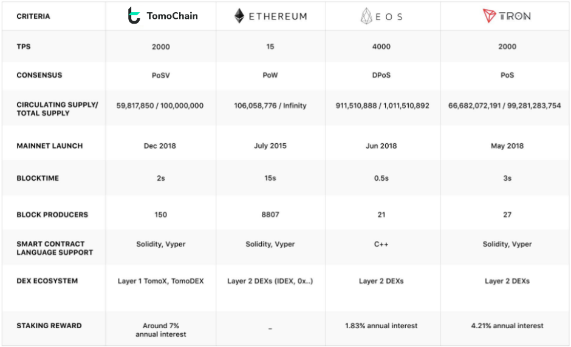

# TomoChain

### What is TomoChain public blockchain?

TomoChain is a scalable public blockchain built on a performance layer that achieves high transaction speeds without compromising decentralization. TomoChain uses an innovative consensus method called PoSV (Proof of Stake Voting) which gives an incentive to all TomoChain token-holders to play an active part in staking across a network of 150 high-quality Masternodes, and to monitor their performance and governance actively.&#x20;

The TomoChain blockchain and its product ecosystem allow builders to build high-performance, feature-rich blockchain projects and Web3 Dapps on an enhanced EVM-compatible platform. An array of original features and protocols is designed to support users’ speed, privacy, usability, and liquidity needs all in one platform.

### What problems does TomoChain solve?

TomoChain focuses on bringing more Decentralized Finance (DeFi) products that are usable and accessible to all types of end users. Moreover, our team will also be focusing on expanding our Dapps & game ecosystem to welcome more developers to build products and exceed their talents.

TomoChain is continuously working and researching several scaling solutions. The Proof-of-Stake Voting consensus enables TomoChain's infrastructure to support low fee and 2-second transaction confirmation times. TomoChain can currently process 2000 transactions per second (TPS).

### How does TomoChain work? What is the architecture and consensus used?

TomoChain relies on a system of 150 Masternodes with Proof of Stake Voting (POSV) consensus that can support low fees (approx. 1/100 of that of Ethereum's) and 2-second transaction confirmation times. Security, stability and chain finality are guaranteed via novel techniques such as Double Validation, staking via smart-contracts and true randomization processes.

### Can you tell more about Proof of Stake Voting (PoSV)? What is it?

At the heart of TomoChain, the Proof-of-Stake Voting (PoSV) consensus enables TomoChain as an EVM-compatible and scalable public blockchain, on which every Ethereum smart contract can be effectively run with almost instant transaction confirmation.

PoSV features its Masternode architecture in which token holders deposit 50,000 TOMO to become a Masternode Candidate and receive votes from other token holders. The most voted Masternode Candidates are selected as Masternodes for block creation within a period, called epoch. Each Masternode takes its block creation in a round-robin manner every 2-second and follows the double validation technique for security reinforcement. A block is finalised if it is signed off by 3/4 Masternodes. At the end of each epoch, the Masternodes that have signed finalised blocks are rewarded. Voters who voted for those Masternodes will also be rewarded.

### What is Double Validation?

Double Validation provides an additional trustless validation layer for security enhancement through a provable uniform distribution decentralized randomization. Specifically, when a block is created by a Masternode, it must be verified by another Masternode that is randomly selected among the set of Masternodes before being added to the blockchain. Double validation strengthens TomoChain’s security, reduces fork and nothing-at-stake attacks, and makes TomoChain unique among other Proof-of-Stake-based blockchains.

### Which scaling solutions will TomoChain implement? Will you have sharding?

TomoChain solutions are based on on-chain scaling built into an architecture of 150 voted Masternodes with our Proof-of-stake Voting (POSV) consensus protocol. We achieve 2-second block-time and almost instant transaction confirmations.

To scale our infrastructure further, we have presented our [Sharding proposal](https://bit.ly/2xHK0u3) for uniquely integrating Sharding into our current architecture and consensus.&#x20;

Besides sharding, we are actively researching scalability solutions like EVM parallelization and Plasma. New scaling techniques such as sharding, EVM parallelisation, private-chain generation, hardware integration will be evaluated before being integrated into TomoChain's Masternode architecture.

### What is the current TPS? What is your targeted TPS and when do you think you can achieve?

TomoChain supports low transaction fees (approx. 1/100 of that of Ethereum's) and 2-second transaction confirmation times. The mainnet with POSV Masternodes delivers 2,000 transactions per second (TPS).

### What makes TomoChain different?

The unique point of TomoChain comes from technology, the products and the ecosystem.

**Novel technology:**&#x20;

* Well-functioning public blockchain with [Proof of Stake Voting consensus](https://www.youtube.com/watch?v=kZSWjAJHW\_s\&t=7s), Masternode system and slashing mechanism in place. 150 Masternodes, and thousands of stakers live securing the network at any given moment.
* Fast chain with 2 second blocktime and reach up to 2000 TPS
* Built-in governance Dapp
* Double Validation and Randomization

**A complete suite of products**

An array of unique products is designed to support speed, privacy, usability, and liquidity needs all in one platform, therefore, introducing more users to the convenience of the decentralized ecosystem

**Our own ecosystem**

* TomoChain Labs also is working vigorously on building its ecosystem and has sealed many partnerships from all fields, such as agriculture, robotics, gaming, IT solution providers, advertising, loyalty points, education and research, payment, communication, name service, food traceability, tourism etc&#x20;
* In collaboration with [TomoMasterDAO](broken-reference), TomoChain Labs offers a developer friendly and scalable environment, extensive support and everything it takes to succeed for all builders.&#x20;

### Which blockchain(s) are TomoChain's main competitors?

On the one hand, all base layer blockchains such as Ethereum, EOS, NEM, NEO, TomoChain etc are competitors because app developers/token issuers will generally choose only one blockchain to work on. On the other hand, it is too early to focus on competition as it is more important to expand the whole blockchain ecosystem.

TomoChain has a unique position in which it adds value to the Ethereum ecosystem by addressing scalability and governance issues while keeping the same smart-contracts and general architecture.

### **TomoChain is EVM-compatible. What does that mean?**

EVM means Ethereum Virtual Machine. TomoChain supports all EVM-compatible smart-contracts, protocols, and atomic cross-chain token transfers. This means that any smart-contract written in Ethereum protocol can be easily ported to TomoChain. Any Dapp written in Ethereum can be seamlessly ported to TomoChain.

### Is TomoChain a side-chain of Ethereum?

No, TomoChain has its own blockchain since TomoChain Mainnet was launched in December 14th, 2018.

### **Is TomoChain compatible with Ethereum?**

Yes, any smart-contract written in Ethereum protocol can be easily ported to TomoChain. This is one strength appealing to some Dapp developers and some of our partners.

### Can developers make hybrid Dapps using both Ethereum and TomoChain in one single Dapp?

Yes, they can make an app, and deploy it to both Ethereum, and TomoChain. It can be done relatively easy since TomoChain supports EVM, and shares a common architecture with Ethereum.

### How do you solve 'security problems' when using TomoChain?

In terms of security of consensus protocol, TomoChain proposes Double Validation and Randomization to protect the system. The details of these techniques can be referred in our [Technical paper.](https://tomochain.com/files/technical-whitepaper-1.0.pdf)

TomoChain solves some core consensus-related security aspects:

1. Nothing-at-stake problem: This problem is commonly discussed in PoS-based blockchain consensus and just like 51% attacks in PoW. TomoChain solves it by using Double Validation and Randomization. The details are shown in our technical paper.
2. Long-range attacks: Attackers can try to recreate all blocks from a very far position to the current block. Attackers can do that because PoS-based consensus does not require extra-ordinary hashing power to re-write the whole blockchain. TomoChain addresses this by providing finality. Once a block is signed by at least 3/4 Masternodes, it is consider irreversible, meaning that any attempt to re-write the blockchain history will be rejected.
3. Censorship-resistance: Please [refer to this medium article](https://medium.com/tomochain/tomochain-vs-eos-io-the-battle-of-posv-vs-dpos-or-just-some-coincidence-of-design-philosophy-b5f606a1e5df) for more detailed analysis
4. DDoS and spamming attacks: TomoChain's transaction fee is not zero (even though it is very low), attackers still require a significant amount of TOMO in order to flood the network for only a short time.

### How does TomoChain defend against spamming attacks?

TomoChain has different measures to defend against spamming attacks.

For instance, increasing transaction fees for smart contract creation is one of them. The minimum is 10 TOMO. Otherwise an error that the smart contract creation cost is under allowance may show up.
