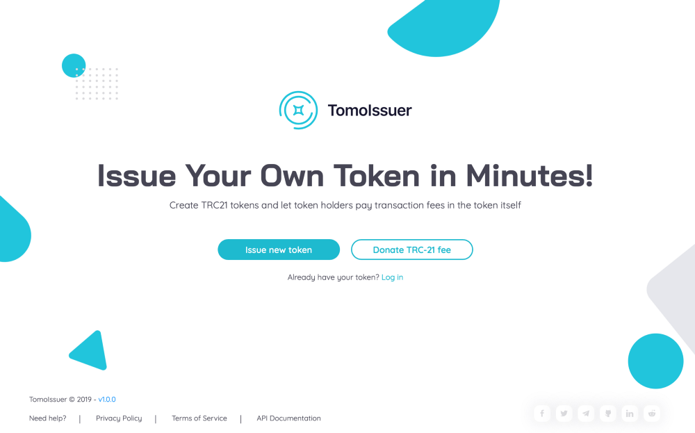
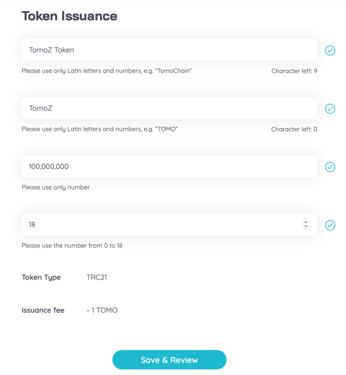
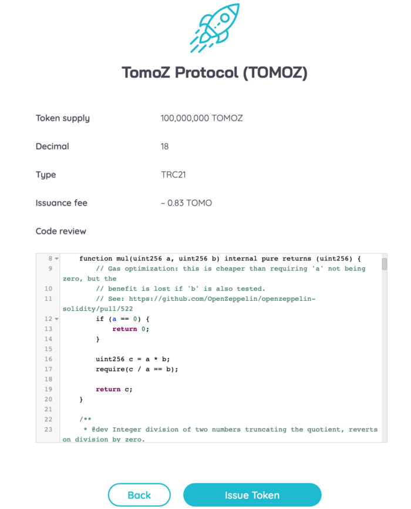
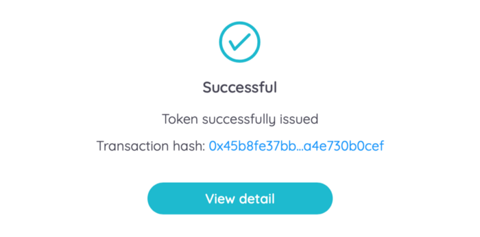
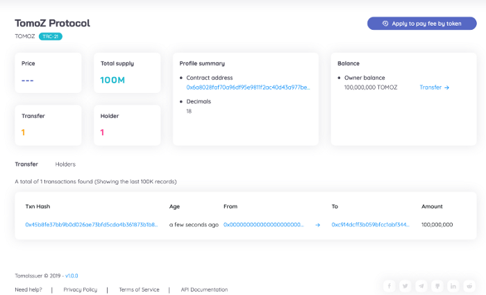
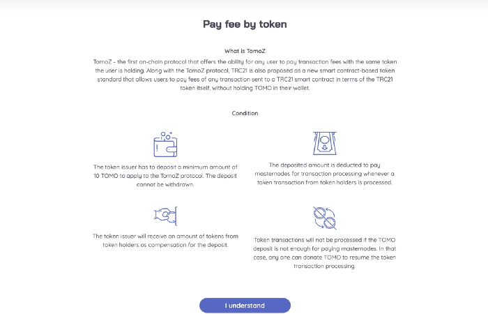
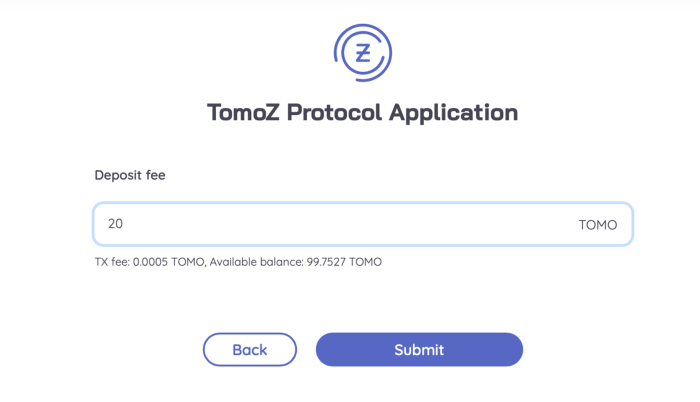
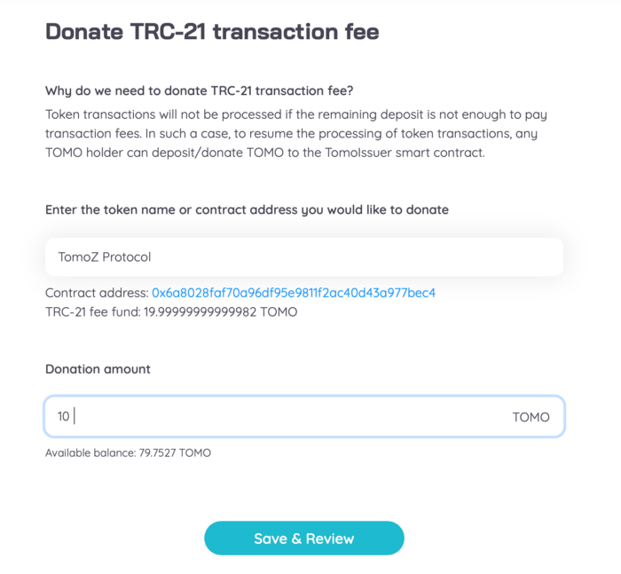

# TomoIssuer

Below are the most important features of TomoIssuer that have made it a revolutionary tool:

* **User-Friendly Interface:** Issue a TRC21 token in only a few steps.
* **No Coding Experience Required:** No prerequisite knowledge about smart contract programming is needed.
* **Token Customization Options:** Customize the token supply, token name, and minimum transaction fee through TomoIssuer’s dashboard.

### Issue token

On the homepage you will see two main options with the TomoIssuer. The first one is to create the new TRC21 token and the second one is to donate fee for an existing TRC21 token.

Go to the Token Issuance dashboard to view the various sets of parameters \(From top to bottom: Token’s Name; Token’s Symbol; Token’s Total Supply, and Token’s Decimals\). A small issuance fee will be charged when issuing a token so make sure that your wallet has enough TOMO. If using our testnet, you can get free testnet TOMO from our [faucet](https://faucet.testnet.tomochain.com/).

**Disclaimer**: The token issuance fee is not fixed, the fee is adjusted by RPC owner who runs the full-node

TomoIssuer will ask you the token’s information to confirm. Please check all the criteria carefully before clicking on the “Issue token” button and wait for the contract to be deployed.

**Note:** Any developer with some experience of developing and deploying smart contracts can refer to our reference implementation of the TRC21 standard to make customizations to the deployed token contract.

### Apply TomoZ protocol

You will receive notification when your token is successfully issued, click “view detail” to check the token’s summary including: number of holders, transactions, etc. Choose “Apply to pay fee by any token” for TomoZ integration.

Once deployed, the issuer needs to claim to the network that the fees for all transactions to the newly deployed token contract will be paid in terms of the issued token. If you agree with the condition then move to the next step by entering “I understand”

Token issuer needs to deposit a minimum amount of 10 TOMO to apply the TomoZ protocol. The deposit can’t be withdrawn and is deducted from to pay Masternodes for transaction processing.

Congratulations! You have already applied your TRC21 token to the TomoZ protocol. Now you can edit the transaction fee \(transaction fee in your token\). You can modify this number anytime you want after issuance during the operation of your token.

In the token management dashboard, you will have some buttons to interact with the tokens such as transfer, deposit more TOMO to pay for subsequent transaction fees. Don’t forget to check your TRC21 fee fund because transactions will not be processed if the remaining deposit is not enough to pay transaction fees.

### Donate transaction fee

If the TOMO funds of the token issuer in TomoIssuer is not enough to pay for subsequent transaction fees, any token holder can deposit more TOMO to the TomoIssuer contract to continue making transactions.

Go to donate transaction fee tab from TomoIssuer’s homepage. Enter the name of token you want to donate fee then input the donation amount. Considering that transaction fee in TomoChain is near-zero, 1 TOMO can power thousands of transactions.

### Transfer token

You can transfer your TRC21 token to any member in your community just by going to “transfer token”. The desktop version of the TomoWallet will start running in a new tab so you can use it to transfer issued token.

