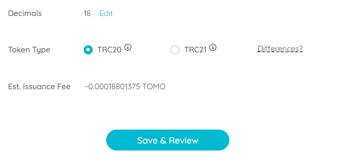

# TomoIssuer

Below are the most important features of [TomoIssuer](https://issuer.tomochain.com/) that have made it a revolutionary tool:

* **User-Friendly Interface:** Issue a TRC20 or TRC21  token in only a few steps.
* **No Coding Experience Required:** No prerequisite knowledge about smart contract programming is needed.
* **Token Customization Options:** Customize the token supply, token name, and minimum transaction fee through TomoIssuer’s dashboard.

**‌Know Your Token Type**

Before issuing your token on TomoChain, make sure you are aware of the available tokens types and the differences between them.

**TRC20:** TRC20 is an equivalent token standard of ERC20 built on top of the TomoChain blockchain. TRC20 token holders would need to hold a small amount of TOMO to cover extremely low transaction fees.&#x20;

**TRC21:** TRC21 creates a much frictionless experience for non-crypto users by allowing token holders to pay transaction fees by the token itself without having to hold any TOMO in their wallet. \

**Comparison Table** &#x20;

|                                                  | **TRC20**             |                                         **TRC21**                                         |
| ------------------------------------------------ | :-------------------: | :---------------------------------------------------------------------------------------: |
| **Technical Requirements for Dapp Integration**  |        **Low**        |                                        **Moderate**                                       |
| **Technical Requirements for Exchange Listing**  |        **Low**        |                                        **Moderate**                                       |
| **Transaction Fees**                             |    **Native TOMO**    | 
<strong>By token itself</strong>

 <strong>(no need for native TOMO)</strong>
 |

### ISSUE&#x20;

**Step 1:**&#x20;

Go to [https://issuer.tomochain.com/](https://issuer.tomochain.com/) and click on “Issue New Token”.&#x20;

 

<figure><figcaption></figcaption></figure>

**Step 2:**

Unlock your wallet by choosing one of the available methods.&#x20;

 

<figure><figcaption></figcaption></figure>

**Step 3:**&#x20;

Fill out the token information including Token Name, Token Symbol, Token Supply, Decimals, Token Type (TRC20 or TRC21), and whether or not it’s reissuable.&#x20;

* The symbol of the token contract is the symbol by which the token contract should be known, for example, “MYT”. It is broadly equivalent to a stock ticker and limited to 5 characters in length.
* Decimals refer to how divisible a token can be, from 0 (not at all divisible) to 18 (pretty much continuous) and even higher if required. Technically speaking, the decimals value is the number of digits that come after the decimal place when displaying token values on-screen.
* Make sure to check out the differences between reissuable/ non-reissuable tokens, and TRC20/ TRC21 tokens by hovering on the information icon and clicking on the “Differences?” link.

 

<figure><figcaption></figcaption></figure>

<figure><figcaption></figcaption></figure>

**Disclaimer:** The token issuance fee could vary depending on how much it costs to deploy the smart contract.

**Step 4:**&#x20;

TomoIssuer will ask for the token’s information to confirm. Please check all the criteria carefully before clicking on the “Issue token” and wait for the contract to be deployed.

**Note:** Any developer with some experience  developing and deploying smart contracts can refer to our reference implementation of the [Standards & Specification](https://docs.tomochain.com/developer-guide/standards-and-specification) to make customizations to the deployed token contract.

**THE STEPS BELOW ARE FOR TRC21 TOKENS ONLY**&#x20;

**Step 5:** A notification is received when the token is successfully issued. Click “View detail” to check the token’s summary including: number of holders, transactions, etc. For TRC21 tokens, choose “Apply to pay fee by token” for TomoZ integration.

**Step 6:** Once deployed, the issuer needs to agree that the fees for all transactions to the newly deployed token contract will be paid in terms of the issued token. Once the conditions are agreed, move to the next step by clicking “I understand”.&#x20;

**Step 7:** The token issuer needs to deposit a minimum amount of 10 TOMO. The deposit can’t be withdrawn. The TOMO held in the deposit pool will be deducted to pay the Masternodes for processing transactions.

**Step 8:** Now the new TRC21 token can be used. Edit the transaction fee in the token itself. Change this number at any time during the operation period of the token.

**Step 9:** In the token management dashboard, there are buttons to interact with the tokens, such as transfer and deposit more TOMO to pay for subsequent transaction fees. Don’t forget to regularly check the balance of the TRC21 deposit because transactions will not be processed if the remaining deposit is not enough to pay the transaction fees.

**DONATE TOMO FOR TRC21 TRANSACTION FEES**

If there are not enough TOMO funds to pay for subsequent transaction fees, any token holders can deposit more TOMO to the TomoIssuer contract to continue making transactions.‌

Go to the **“Donate TRC-21 fee”** tab from TomoIssuer’s homepage. Enter the name of the token to donate TOMO to, then enter the donation amount. Considering that the transaction fee in TomoChain is near-zero, 1 TOMO can power thousands of transactions.

****
