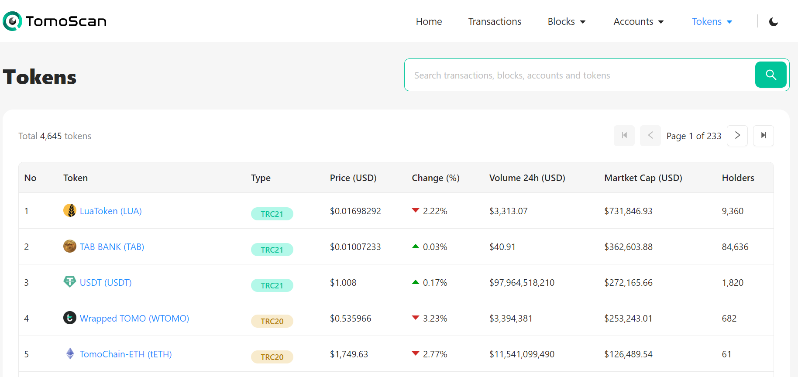
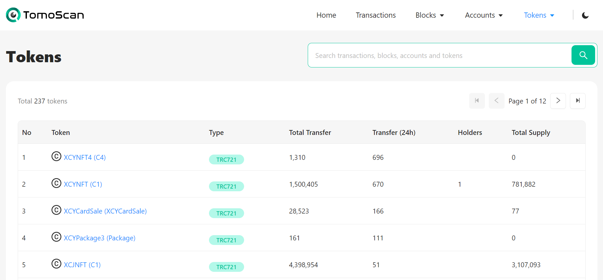
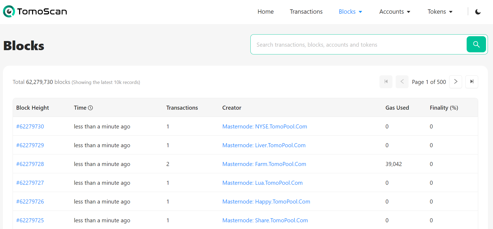
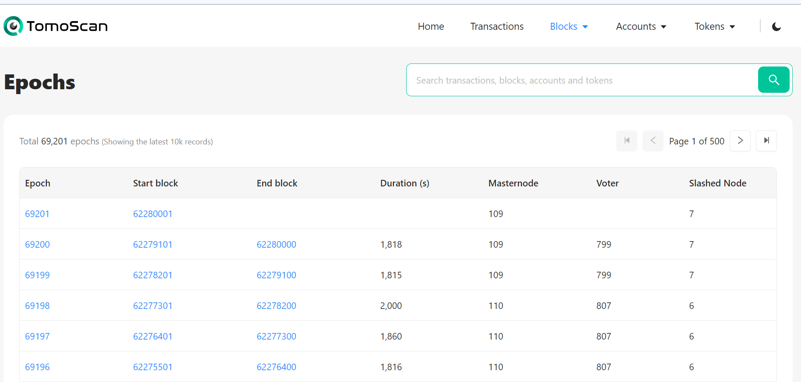

# TomoScan (Explorer)

## **General Questions** &#x20;

### **What is TomoScan?**

[TomoScan](https://tomoscan.io/) is a block explorer for TomoChain. It is pretty similar to EtherScan used on the Ethereum network if you are already familiar with it.

TomoScan provides a user-friendly interface to explore the TomoChain blockchain. From a user perspective, TomoScan provides transparency because all block information, transactions, finality, smart contracts, Dapps and token information are read from TomoChain and displayed here. Furthermore, TomoScan offers technical visualisations and useful statistics about TomoChain performance, token holders and other functionalities.

### **What is a TxHash? How to check a TxHash?**

TxHash stands for 'transaction hash', and is also known as a transaction ID.

An example of what a TxHash looks like: `0xedab9e59d4567e9ced8d61caefe20e1e2a3fe95cceaaeabc98466ef3f03c0eca`

To check a TxHash, follow the steps below:

On [TomoScan](https://tomoscan.io/), go to the search bar with the magnifying glass icon. Paste your transaction hash (TxHash) in the search bar and click the icon or press ENTER. Your transaction details will show up.

Example: [https://tomoscan.io/txs/0xedab9e59d4567e9ced8d61caefe20e1e2a3fe95cceaaeabc98466ef3f03c0eca](https://tomoscan.io/txs/0xedab9e59d4567e9ced8d61caefe20e1e2a3fe95cceaaeabc98466ef3f03c0eca)

## Features&#x20;

### [Home](https://tomoscan.io/)

<figure><figcaption></figcaption></figure>

This is the home page of TomoScan. In the middle of the page you can find a search field that lets you find anything by its address. Under it, some general stats gives you the total amount of accounts, tokens, contracts and blocks.

### [Transactions](https://tomoscan.io/txs) 

<figure><figcaption></figcaption></figure>

When consulting a single transaction, the page lists the following information: - The transaction ID. - The transaction method. - The transaction containing block. - The transaction age. - The transaction sender address. - The transaction recipient address. - The transaction amount in TOMO. - The transaction fee.

### [Accounts](https://tomoscan.io/accounts) 

<figure><figcaption></figcaption></figure>

#### [All accounts](https://tomoscan.io/accounts) 

All the accounts that exist on the chain. The page lists the following information: - The account rank (ordered by balance). - The account address. - The public tag - The account balance in TOMO. - The proportion in total supply - The account transaction count.

#### [All Masternodes](https://tomoscan.io/masternodes) 

All the Masternode accounts that exist on the chain. The page lists the following information: - The account rank (ordered by capacity) - The account address. - The account name. - The account status - The account capacity - The account link to the Masternode's owner - The account linked to the Masternode's latest signed block.

<figure><figcaption></figcaption></figure>

#### [Verified Contracts](https://tomoscan.io/contracts) 

All the verified contracts that exist on-chain. A contract has to be manually verified by its owner to appear here. The page lists the following information: - The account rank (ordered by Txn count) - The account address. - The account contract name. - The public tag - The account balance in TOMO. - The account transactions count. - The account contract verification date. - The account compiler

<figure><figcaption></figcaption></figure>

### [Tokens](https://tomoscan.io/tokens) 

<figure><figcaption></figcaption></figure>

List of tokens on TomoChain including TRC20, TRC21 and TRC721, and their transfers.

#### [TRC20/21 Tokens](https://tomoscan.io/tokens) 

All the TRC20/21 tokens on the chain. The page lists the following information: - The token rank (ordered by Market cap) - The token name - The token type - The token price - The token change in 24h - The token's 24h volume - The token's market cap - The token's holders

#### [TRC721 Tokens](https://tomoscan.io/tokens/trc721) 

<figure><figcaption></figcaption></figure>

All the TRC721 tokens on the chain. The page lists the following information: - The token rank (ordered by 24h transfer) - The token name - The token type - The token's total transfer - The token's 24h transfer - The token's holders - The token's total supply

### [Blocks](https://tomoscan.io/blocks) 

<figure><figcaption></figcaption></figure>

List of all blocks on TomoChain. The page lists the following information: - The block height (index). - The block age. - The block number of transactions. - The block creator. - The block total gas used. - The block finality.

#### Finality

The percentage of the network which validated this block. When it reaches 75%, the block has reached its finality state and is added permanently to the chain.

#### [Epoch](https://tomoscan.io/epochs) 

<figure><figcaption></figcaption></figure>

List of all epochs on TomoChain. The page lists the following information: - The epoch number - The start block number - The end block number - The epoch's duration - The number of masternode - The number of voter - The number of slashed nodes \
