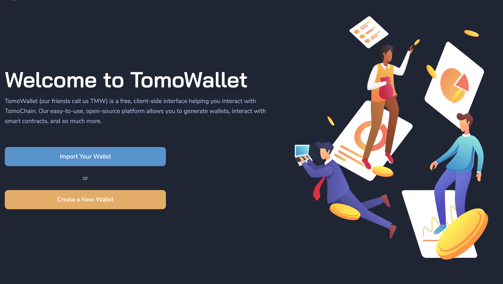
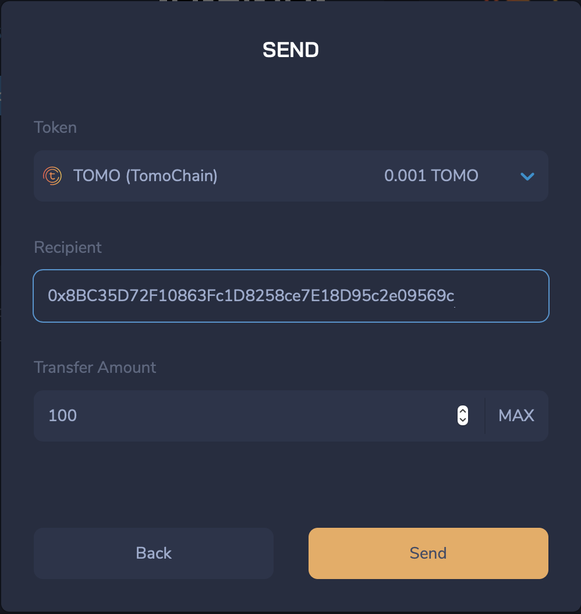
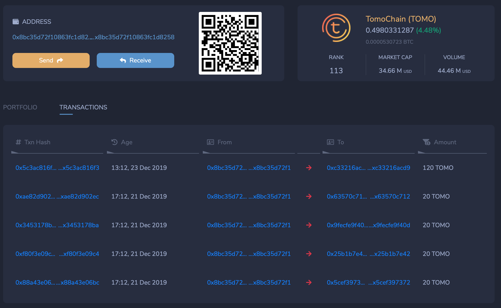
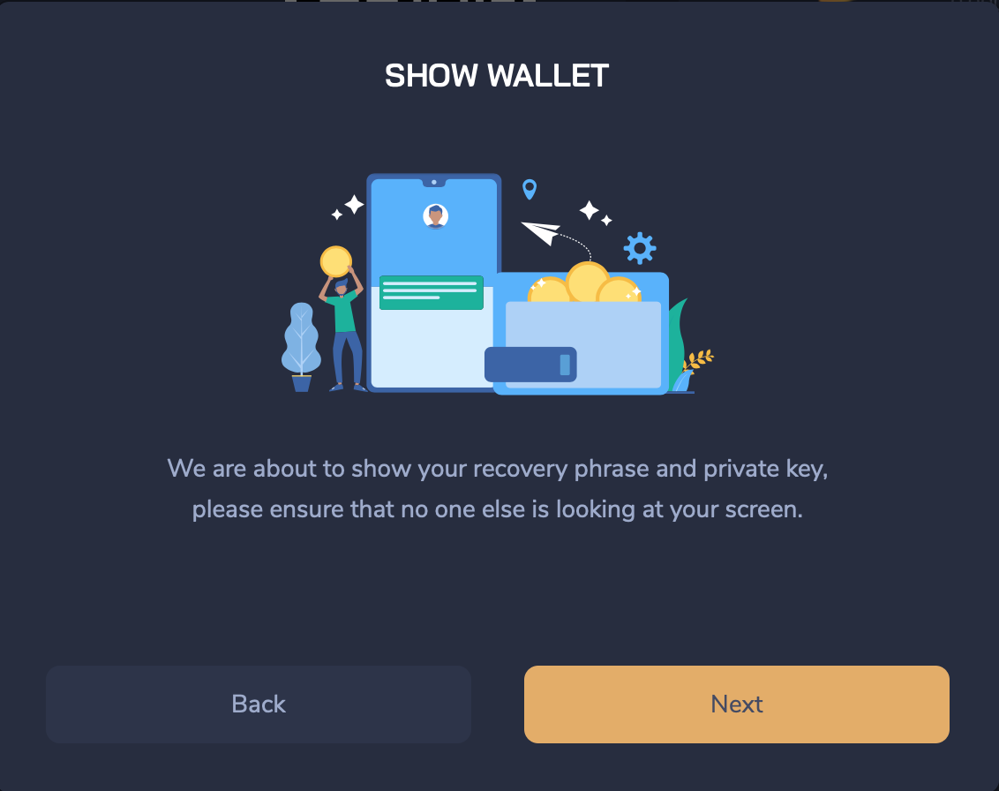

# TomoWallet

Use TomoWallet Web version at [https://wallet.tomochain.com/](https://wallet.tomochain.com/) or download TomoWallet App from [Apple Store](https://itunes.apple.com/vn/app/tomo-wallet/id1436476145) or [Google Play](https://play.google.com/store/apps/details?id=com.tomochain.wallet). You can create a new wallet, import an existing wallet, vote for Masternodes and transfer/receive TOMO back and forth as well as manage your votes and rewards.


Under Settings you can Choose Network: TomoChain \(Mainnet\) or TomoChain Testnet.


### **1. Create Wallet**

To create and experience the features in web version of TomoWallet, you follow two steps as illustrated:

Step 1: Visit [https://wallet.tomochain.com](https://wallet.tomochain.com/#/login) 

Step 2: Click “Create a New Wallet” or "Import Your Wallet" with private key, recovery phrase.

### **2. Making Transaction from TomoWallet**

For exchanging and trading TOMO among users on TomoChain, you can use the “Send TOMO” feature to send TOMO from one’s wallet to another wallet, or to receive TOMO in your wallet.


To prepare for the TOMO Send-Receive feature on the mobile platform conveniently and securely, TomoChain integrates the QR Code into the system. 


### 3. Check the transaction information

When you make a transaction on TomoWallet, this transaction is logged and saved. You can view this information by clicking on the link to TomoScan.

### 4. Private Key & Backup Key

These are two special features that help users to access their TomoChain wallets through other 3rd party wallets.

To view this information, click on the My Wallet in the top right corner of the screen and then select Show my Wallet to see your Private Key / Backup Key.


Please ensure that no one else can see your recovery phrase or private key.


