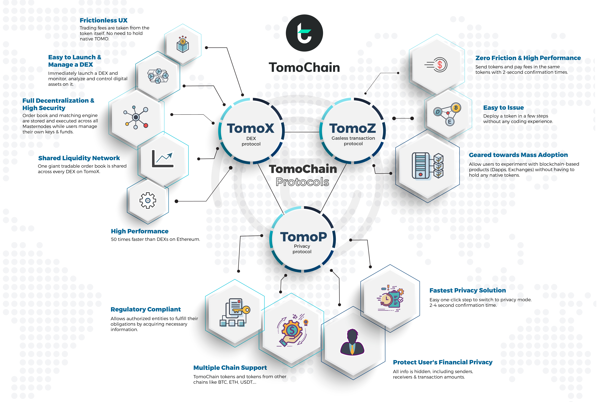

# Overview

The backbone of TomoChain's products and overall ecosystem is the TomoChain blockchain with its innovative Proof-of-Staking Voting \(PoSV\) consensus. To facilitate interactions between users \(including Voters and Masternode owners\) and the TomoChain blockchain, a set of protocols and products have been built to support speed, privacy, usability, and liquidity needs all in one platform. Our goal is to develop highly innovative products and technologies to make TomoChain an ideal platform for blockchain games, decentralized finance, and enterprise-oriented applications. 

* **TomoChain**: TomoChain is the core public blockchain powering every Protocol, Product, and Dapp built on it.
* **TomoScan**: TomoScan provides a user-friendly and detailed blockchain explorer user interface for TomoChain. All blocks, transactions, finality, smart contracts, Dapps and token information are captured. Also offered are technical visualizations and useful statistics about TomoChain performance, token holders and other functionalities.
* **TomoStats**: TomoStats is a dashboard for TomoChain's network status. It shows various metrics, including the current number of masternodes, masternode performance, current TPS, block time, confirmation time, finality and other useful metrics.
* **TomoMaster**: TomoMaster is a governance Dapp that allows users to see a list of Masternodes and Masternode Candidates. TomoMaster is also used to launch a Masternode Candidate, vote for Masternodes, and view Masternode performance statistics.
* **TomoWallet**: TomoWallet is the official mobile wallet of TomoChain. Users can store TOMO, tokens issued on TomoChain, vote for Masternodes, track rewards and interact with Dapps.
* **TomoBridge**: TomoBridge connects TomoChain and other chains. It allows users to easily migrate native TOMO from TomoChain mainnet to another chain and vice versa. 
* **TomoX**: TomoX is a Layer-1 decentralized cryptocurrency exchange protocol to launch permissionless Decentralized Exchanges \(called Relayers\). Relayers can be launched in minutes and perform at almost 50x faster than competing DEX solutions. 
* * **TomoRelayer:** TomoRelayer is a dashboard to register and launch a DEX by depositing 25,000 TOMO. Its admin dashboard allows operators to monitor, analyze and control digital assets on the DEX with a professional interface. 
* **TomoZ**: TomoZ allows any token holder to transfer tokens without holding TOMO in their wallet. The transaction fees will be paid in the token the user is holding.
* * **TomoIssuer**: TomoIssuer is a dashboard to issue a TRC21 token and apply the token to the TomoZ protocol in minutes without requiring any programming skills.
* **TomoP**: TomoP is a comprehensive privacy suite delivering the fastest privacy transactions, Dapp integration, multi-chain support, and private token issuance with regulatory compliance. TomoP is designed to create safe and untraceable transactions where sender/receiver wallet addresses and transaction values are hidden. 

