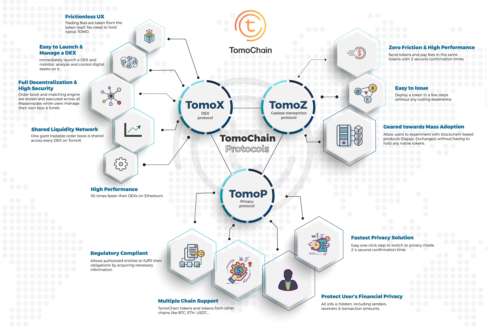

# Overview

The backbone of TomoChain's products and ecosystem is the TomoChain blockchain with its innovative Proof-of-Staking Voting \(PoSV\) consensus. To facilitate interactions between users \(including voters and asternode owners\) and the TomoChain blockchain, a set of products have been built, including TomoScan, TomoMaster, TomoWallet, TomoStats and our other products. TomoChain has also been developing a full suite of core protocols to protocols to support speed, privacy, usability, and liquidity needs all in one platform. These products and protocols will be continuously improved in our long-term plan. Furthermore, more highly innovative products and technologies will be intensively developed and researched to make TomoChain become an ideal platform for blockchain games, open finance, and enterprise-oriented applications. 

* **TomoChain**: TomoChain is the backbone public blockchain of TomoChain's product map.
* **TomoScan**: TomoScan provides a user friendly, detailed and perfection-oriented user interface for TomoChain block explorer. From a user perspective, TomoScan brings TomoChain’s transparency to users, because all blocks, transactions, finality, smart contracts, Dapps and token information are read from TomoChain and shown to users. Furthermore, TomoScan also offers technical visualisations and useful statistics about the TomoChain performance, token holders and other functionalities.
* **TomoStats**: TomoStats is a dashboard for TomoChain network status. It shows various metrics, including the current number of masternodes, masternodes performance, current TPS, block-time, confirmation time, finality and other useful metrics.
* **TomoMaster**: the `Governance Dapp` - TomoMaster provides a professional UI that allows users to see the list of Masternodes and Candidates, to deposit 50,000 TOMO to become a Masternode Candidate, to vote for Masternodes, and to show Masternode performance statistics.
* **TomoWallet**: TomoWallet is the official mobile wallet of TomoChain. Users could use TomoWallet to store TOMO, tokens issued on TomoChain, vote for Masternodes, track rewards and play with games, Dapps on TomoChain.
* **TomoBridge**: TomoBridge connects TomoChain and other chains. It allows users to easily migrate native TOMO from TomoChain mainnet to another chain and vice versa. The latest example is with TOMO on Binance Chain.
* **TomoX**: TomoX is a decentralized cryptocurrency exchange directly integrated into the core layer of the TomoChain blockchain. Decentralized exchanges \(called Relayers\) \(DEXs\) built following the TomoX standard will all interact with TomoX.
* * **TomoRelayer:** TomoRelayer is a dashboard to register and launch a DEX by depositing 25,000 TOMO, then monitor, analyze and control digital assets on the DEX with a professional interface. 
* **TomoZ**: TomoZ is a TomoChain on-chain protocol that allows any token holders to transfer tokens without holding TOMO in their wallet. The transaction fees will be paid in the token the user is holding.
* * **TomoIssuer**: TomoIssuer provides a user-friendly UI and a smart contract that allow any user to issue a TRC21 token and apply the token to the TomoZ protocol in minutes without any programming skills required.
* **TomoP:** TomoP is a protocol designed to create safe and untraceable transactions. Users' privacy will be protected with information about senders/receivers wallet addresses and transaction values being hidden. TomoP is a comprehensive privacy suite delivering the fastest privacy transactions, Dapp integration, multi-chain support, and private token issuance with regulatory compliance.

