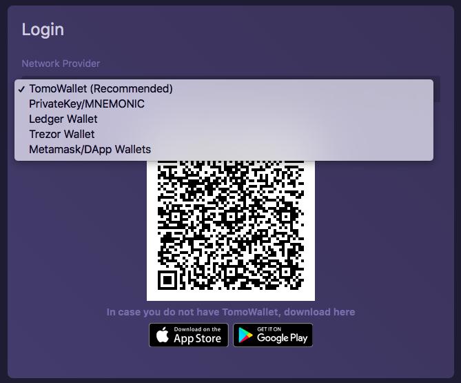

# Staking Requirements

### Prerequisites 

* Have a wallet connected to the TomoMaster

### Introduction 

With a connected wallet, it's time to try voting for some masternodes. If you have any trouble with connecting to TomoChain ntwork you can go to [How to Connect to TomoChain Network](../how-to-connect-to-tomochain-network/).

### How To Vote 

Now you have some TOMO. You can access our governance DApp, [TomoMaster](https://master.testnet.tomochain.com/), to start voting for masternodes.

TomoMaster natively supports Metamask. You can also access your account page \(the vertical three dots on the top right\) to fill in your wallet Private Key or MNEMONIC \(see image below\).

If you use Metamask, you need to connect Metamask to our testnet \(please see the "Create a wallet" section\) and choose Metamask in the drop-down settings list.

Once configured, you can vote for masternodes by clicking on the `Vote` button.

At least 100 TOMO is required per vote. After clicking submit, your TOMO will be sent to the voting smart contract and locked there.

### How to Unvote 

If you do no longer wish to support a masternode you've voted for, you can unvote it by clicking the `Unvote` button on the masternode's page and enter the amount of TOMO you want to unvote.

After unvoting, your TOMO is still locked in the smart contract for ~48 hours \(96 epochs\) before you are able to withdraw.

### How to Withdraw 

To withdraw after unvoting, you need to wait until your TOMO is unlocked from the smart contract. Then you can click the `withdraw` button in your account page \(the vertical three dots on the top right\) and choose the withdrawal you wish to withdraw back into your wallet.

Note that you might see multiple withdrawals on your account page if you've made multiple unvotes previously.

If you attempt to withdraw before the unlock period expires, an error will be raised.

