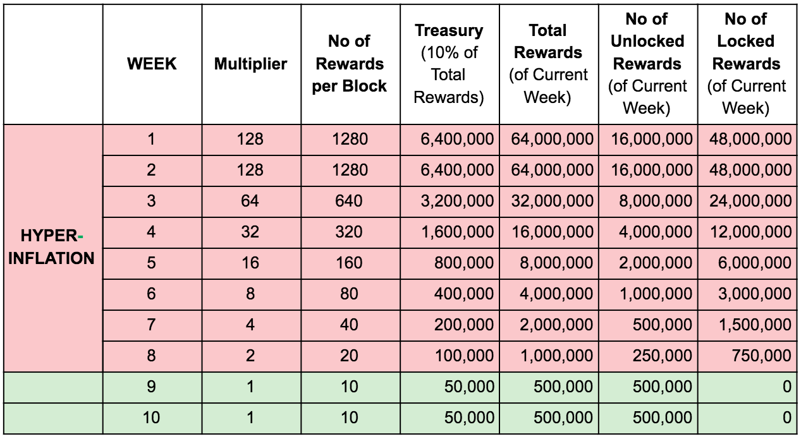

# FAQ

### 1. What is LuaSwap?

LuaSwap is the new swap protocol inspired by the previous AMM-based swap protocols such as Uniswap and SushiSwap. However, LuaSwap’s redesigned tokeneonomics and operation strategy addresses the short-comings of other swap systems. At the core, LuaSwap delivers a community-governed, multichain protocol via the LUA token. The focus is to support smaller pools of emerging tokens instead of fighting for liquidity within the top token pools.

### 2. What is the LuaSwap V1.0?

LuaSwap completed the migration of liquidity from Uniswap on October 29th, 2020. This means that all liquidity previously deposited on Uniswap has now been moved to LuaSwap V1.0.

### 3. What happen to the staked LP token on Uniswap?

All Uniswap LP tokens (UNI-V2 LP token) have been converted to LuaSwap LP tokens (LUA-V1 LP token), representing the exact same share of liquidity in the LuaSwap liquidity pools.

No action was required for Liquidity Providers (LP) who staked their Uniswap LP tokens on LuaSwap before the migration.** **LuaSwap LPs will only need to re-approve the LP tokens contract in LuaSwap before unstaking or staking additional LP tokens on LuaSwap.

### 4. What is LUA token?

LUA token is a native token of LuaSwap protocol to incentivize them to stay with the LuaSwap. Holding the LUA token means holding a share in the governance of the protocol. All LUA token holders can decide the subsequent chains to implement LuaSwap on, how much LUA to distribute to LPs in the new chain, which new token projects LuaSwap should support, etc. LUA hard-cap is at 500 million tokens.

### 5. Where to store LUA token?

Lua token is an ERC-20 token, therefore you can store LUA in an Ethereum address (TomoWallet, Metamask, TrustWallet, Wallet Connect, Coinbase Wallet, and others). Make sure you own a private key/seeding phrase and can access the Ethereum address. On the TomoWallet app, import your address you received LUA > switch the network to Ethereum > you will see your LUA balance. 

We also have wrapped LUA TRC21 on TomoChain and you can store it on TomoWallet, Metamask, TrustWallet, Pantograph Wallet, Coin98 wallet; and others.

Besides, wrapped LUA on Solana network can be stored on Solet Wallet and others.

### 6. What is the LUA reward distribution plan?

The first 8 weeks have HYPER-INFLATION

* Rewards: 128X of base reward for 2 weeks, then halved every week until Week 8.
* 25% of earned LUA is unlocked immediately. 75% is locked for 16 weeks, then unlocked linearly every block over 1 year, starting Week 17.

### 7. Besides farming, is there anyway I can get LUA tokens? Any exchange listing?

You can get LUA by farming on [luaswap.org](http://luaswap.org) or purchase it via exchanges

* For TRC-21 LUA: Trade on TomoDEX; LuaSwap (on TomoChain network)
* For ERC-20 LUA: Trade on FTX; CoinOne; Hotbit; LuaSwap (on Ethereum network); and others
* For wrapped LUA on Solana network: Trade on Serum, Raydium and others

We will update you on [Telegram ](https://t.me/LuaSwap)and [Twitter](https://twitter.com/LuaSwap) 

### 8. How to stake LP tokens to farm LUA?

To receive the LUA reward, follow the steps below: 

* Add Liquidity to our Golden Field on LuaSwap to receive LUA-V1 LP token. Guide [HERE](tutorial/how-to-add-remove-liquidity-on-luaswap.md) 
* Go to [LuaSwap.org](http://luaswap.org) 
* Stake your LP token into the reward contract and start receiving the LUA reward. Guide [HERE](tutorial/how-to-stake-lp-token-for-lua-rewards.md)

### 9. What is the swapping fee on LuaSwap?

The swap fee is set at 0.4%, of which 0.05% goes to LuaSafe stakers (more on LuaSafe below), and the remaining 0.35% goes to LPs.

### 10. How about the treasury fund?

An additional 10% of all LUA distributions will be set aside for the LUA treasury. The LUA treasury will be spent on auditing, development, rewarding contributors, and supporting new token projects by providing liquidity to LUA/new token pool. This 10% of all LUA rewards generated within the first 8 weeks are also locked based on the unlock plan.

### 11. What is [LuaSafe](luasafe.md)?

LuaSafe is LuaSwap staking pool, where you can lock (stake) your LUA to earn passive income. LuaSafe income is generated through a portion of fees collected and distributed in the following way:

* 0.05% from swap fees across all pairs 
* 0.1% from withdrawal fees for LPs withdrawing liquidity from liquidity pools.
* [0.5%](https://snapshot.luaswap.org/#/luaswap/proposal/QmRheZC6Ap1u2myBkL3CAbKft6Lnw4oHvEDh1RDAuNK8iA) from users withdrawing their LUA staked in LuaSafe

As fees are collected they are converted to LUA and distributed proportionally across holders in the xLUA pool. So when you withdraw your xLUA back into LUA it will be worth more LUA than when you put in. You can stake/unstake in LuaSafe any time without locking period. But kindly note that there is 0.5% exit fee for stakers.

### 12. How are LuaSafe rewards distributed?

“CONVERT” button on LuaSafe will trigger reward distribution for the selected pair by calling 2 functions directly to the smart contract LuaMaker, which will perform the following:

* Burn collected LP tokens from withdrawal fees and swap fees
* Buy LUA at market price and send it into the LuaSafe contract.

The core team will trigger distribution every Monday, generally around noon Singapore time (GMT+8) or earlier if the pair’s collected fee reaches a certain significant amount _**(equivalent to at least 3,000 LUA after converted)**_. Users do not need to pay any gas fee for the distribution unless they choose to manually trigger the distribution process themselves.

Anyone can trigger distribution at any time by selecting the “CONVERT” buttons. Users need to pay the gas fee for the distribution if they choose to do it themselves.

### 13. How to use LuaSwap Snapshot for governance voting?

Follow our instruction [here](tutorial/how-to-use-luaswap-snapshot-for-governance-voting.md) on how to create/vote for a proposal on [LuaSwap Snapshot ](https://snapshot.luaswap.org/#/luaswap)

### **14. Can I harvest my locked LUA on LuaSwap on TomoChain?**

No you can not.** **LUA locked token is ERC20 and you need to interact with Ethereum smart contract to unlock that. Therefore make sure that you are on Ethereum network to unlock your locked LUA.

### **15. Where I can see my locked LUA on the new version of LuaSwap?**

Go to address bar on the top right of your screen then you can see your locked LUA tokens**.**

### **16. How much does it cost to swap on LuaSwap TomoChain?**

Tx fee in the TomoChain is much lower than Ethereum \~ 0.00003 TOMO/swap**.**

### **17. Does LuaSwap share the same liquidity source on both TomoChain and Ethereum? How can I move liquidity from Ethereum to TomoChain on LuaSwap?**

LuaSwap operates independently on both the TomoChain & Ethereum Blockchains so it does not share the same liquidity source on both networks. 

You can remove liquidity on Ethereum version then add it to TomoChain version.


[how-to-add-remove-liquidity-on-luaswap.md](tutorial/how-to-add-remove-liquidity-on-luaswap.md)


\

\

\

