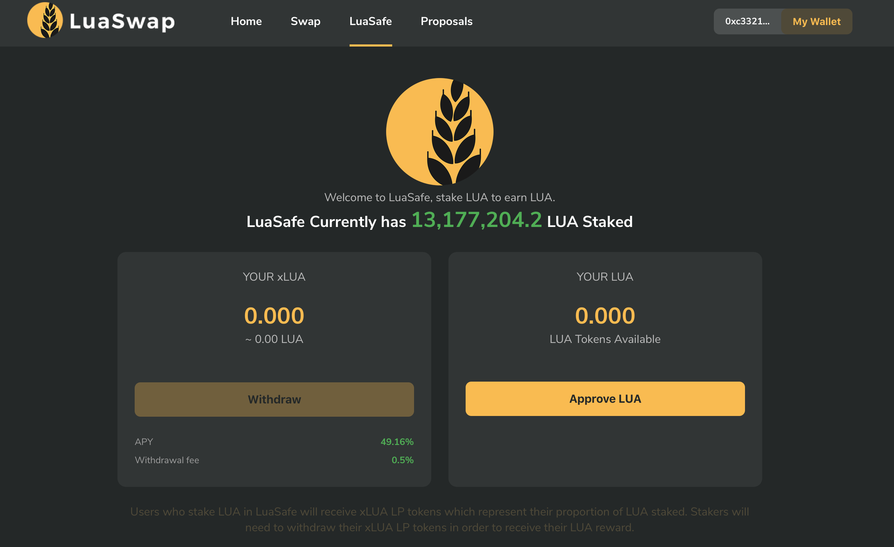
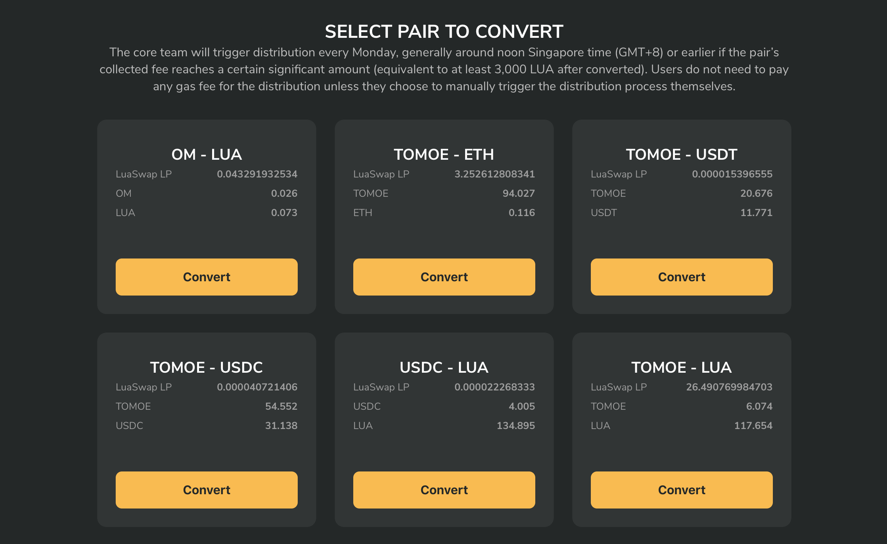
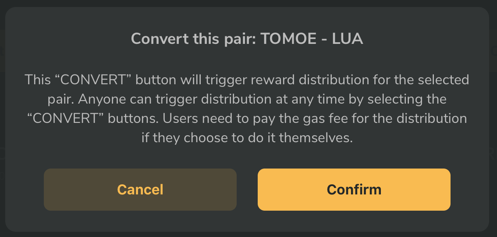

# LuaSafe

[LuaSafe](https://luaswap.org/#/Staking) is LuaSwap’s LUA-specific staking pool, where LUA holders can stake LUA to earn passive income. Follow the instruction below to stake LUA and earn more LUA.

### Go to [https://luaswap.org/\#/Staking](https://luaswap.org/#/Staking)

Connect your wallet via MetaMask/Wallet Connect

### Approve your LUA

First, you may need to "Approve" the Sushi token before you are able to use it. Simply hit the "Approve SUSHI" button and sign the transaction with your wallet or MetaMask.

### Stake LUA to receive xLUA

Stake your LUA to receive xLUA represent your  proportion of LUA staked. xLUA LP tokens will collect all income generated by LuaSafe. 

LuaSafe income is generated through a portion of fees collected and distributed in the following way:

* 0.05% from swap fees across all pairs 
* 0.1% from withdrawal fees for LPs withdrawing liquidity from liquidity pools.
* [0.5%](https://snapshot.luaswap.org/#/luaswap/proposal/QmRheZC6Ap1u2myBkL3CAbKft6Lnw4oHvEDh1RDAuNK8iA) from users withdrawing their LUA staked in LuaSafe

As fees are collected they are converted to LUA and distributed proportionally across holders in the xLUA pool. So when you withdraw your xLUA back into LUA it will be worth more LUA than when you put in.

### Convert function and reward distribution on LuaSafe

“CONVERT" button on LuaSafe will trigger reward distribution for the selected pair by calling 2 functions directly to the smart contract LuaMaker, which will perform the following:

* Burn collected LP tokens from withdrawal fees and swap fees
* Buy LUA at market price and send it into the LuaSafe contract.

The core team will trigger distribution every Monday, generally around noon Singapore time \(GMT+8\) or earlier if the pair's collected fee reaches a certain significant amount \(equivalent to at least 3,000 LUA after converted\). Users do not need to pay any gas fee for the distribution unless they choose to manually trigger the distribution process themselves. Anyone can trigger distribution at any time by selecting the “CONVERT" buttons. Users need to pay the gas fee for the distribution if they choose to do it themselves.


There is a flat fee of 0.5% levied for all withdrawals. Withdrawals can be done at any time.


