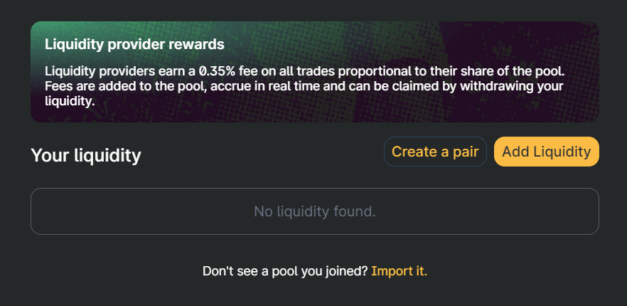
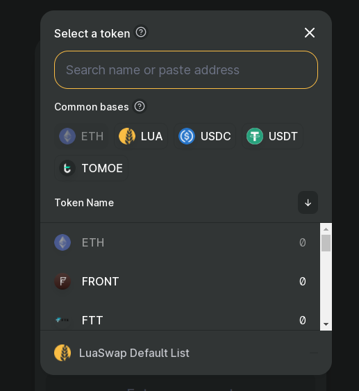
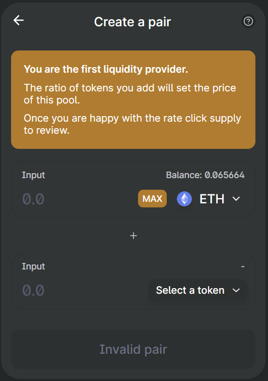

# How to create a new pair on LuaSwap

### **Step 1: Go to** [**https://luaswap.org**](https://luaswap.org)

then click on **Pool** in **Product** tab

Connect to LuaSwap via your wallet

_Note:_  _Using LuaSwap’s Ethereum version requires the Metamask network to be set to Ethereum. Likewise using LuaSwap’s TomoChain version requires the Metamask network to be set to TomoChain. Follow_ [_this guide_ ](https://docs.tomochain.com/general/how-to-connect-to-tomochain-network/metamask)_to learn more._



### Step 2: Select a pool

Click on “Create a pair”

Search for your liquidity pool by choosing 2 tokens from LuaSwap menu or pasting the smart contract address into the search bar, make sure to double-check the correct information. 

### Step 3: Add liquidity

You need to add initial liquidity for your pair. You need to cover both sides, so you will be depositing both tokens into the pool. Depending on how much you deposit of both, the price will be automatically set. Note that the amount of liquidity you add to the pool will determine the initial rate of the token.

### Step 4: Confirm supply

Make sure to double-check the correct information, LuaSwap will show you the details of the transaction, including the amount of LUA LP V1 tokens you will receive. Click “Confirm Supply” once you’ve agreed with all of the details.

Congrats, you just listed your token to LuaSwap. Although your token is now on LuaSwap, it will not show up in the tokens menu. You will need to contact LuaSwap's team on telegram about joining LuaSwap's token list if they want it on the dropdown menu. 

