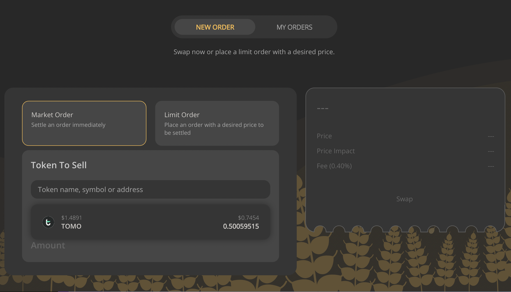
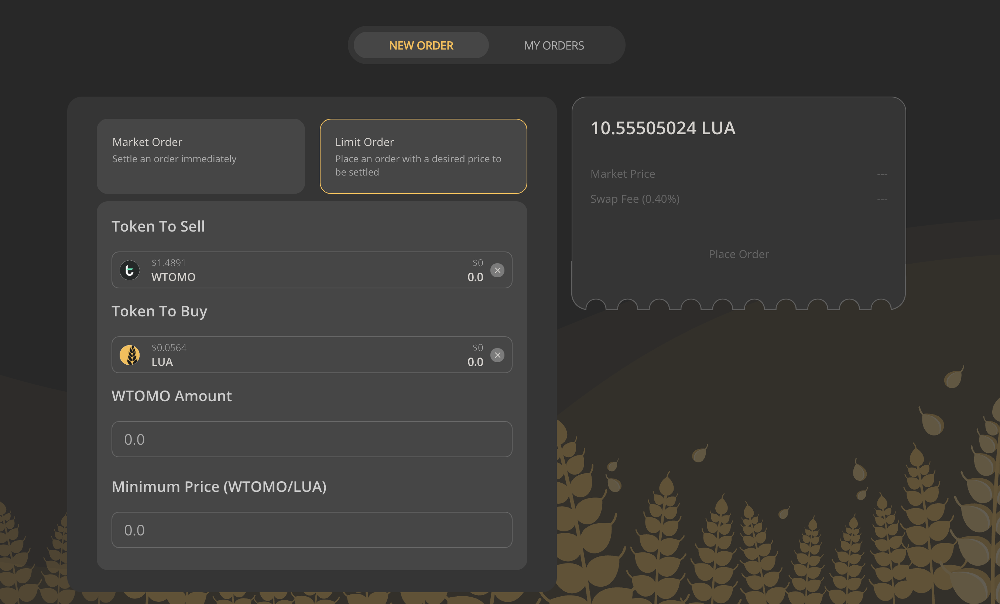
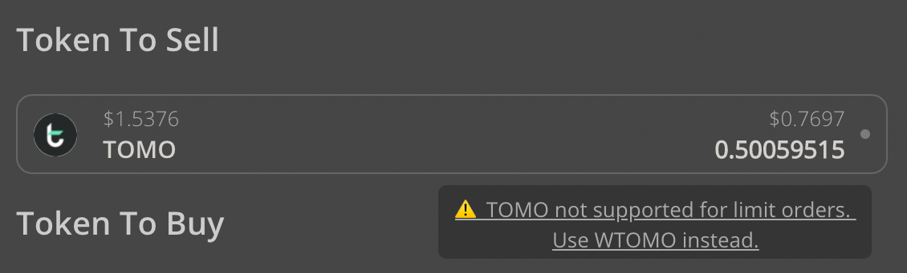
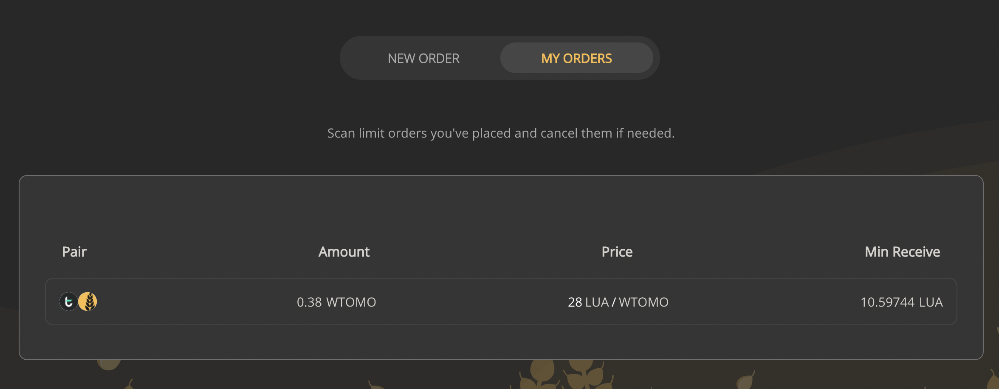
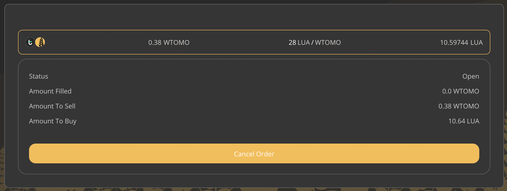

# How to place a limit order on LuaSwap TomoChain

A market order is an order to buy or sell a token with the best available price in the current market. This is the default order type on AMMs and LuaSwap right now, it is the quickest way to execute your trade and your token will be swapped immediately. A limit order is an order to buy or sell a token at a specific price.

LuaSwap limit order is now available on TomoChain network, to create a limit order on LuaSwap, perform the following steps:

**Step 1**: Go to: [https://app.luaswap.org/orderbook/\#](https://app.luaswap.org/orderbook/#)

**Step 2**: Connect to your wallet on Metamask using [this docs](https://docs.tomochain.com/general/how-to-connect-to-tomochain-network/metamask)

**Step 3**: Select token you want to buy/sell then enter your amount


TOMO is currently not supported for this function. Pls convert your native TOMO to WTOMO using [LuaSwap](https://app.luaswap.org/#/swap?outputCurrency=0xB1f66997A5760428D3a87D68b90BfE0aE64121cC) before setting a Limit Order


Check your order on "My order" section

If you no longer want to keep this order, use the ‘cancel’ option of your order.

