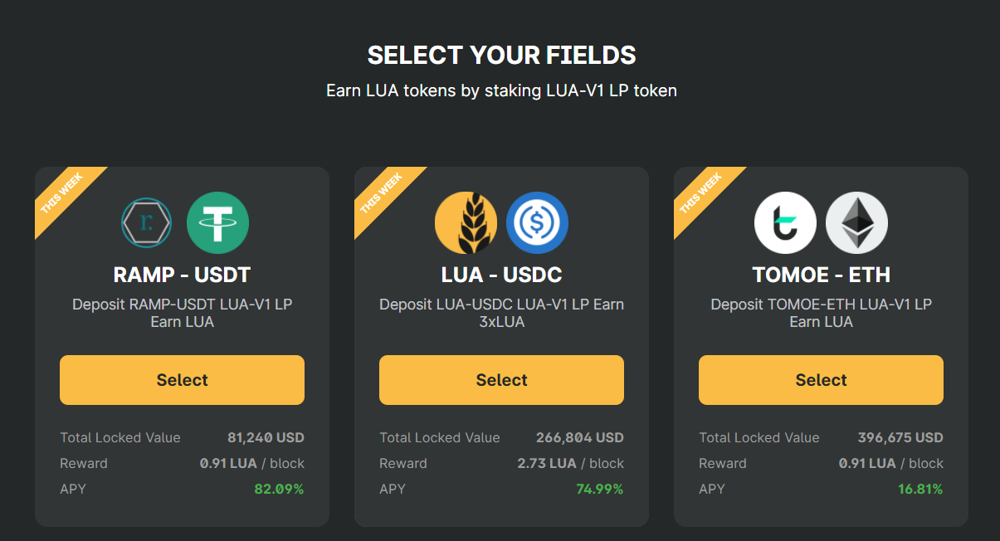
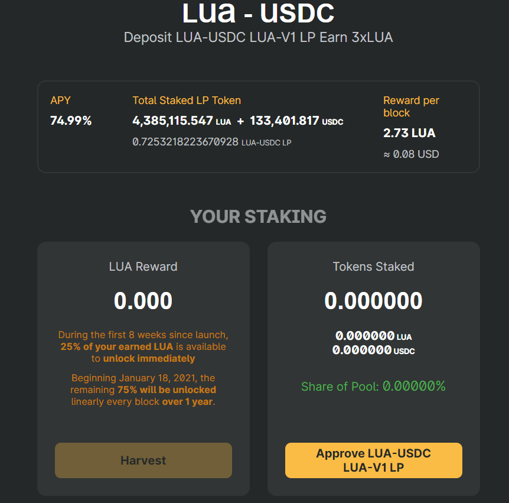

# How to stake LP token for LUA rewards

The LUA token distribution will start at block **10,950,600** on September 28 2020. 

The LUA token distribution will start at block **10,950,600** on September 28, 2020. 

The LUA token will only be minted and distributed to Liquidity Providers \(LPs\) of the Farming set they also stake their LP tokens on LuaSwap 

Once you have added liquidity on LuaSwap,  deposit the LP tokens to the LuaSwap contract of the corresponding LuaSwap field using the interface at [https://luaswap.org](https://luaswap.org/).  To learn how to stake your LP tokens, read the following tutorial carefully.   
  
****Go to [https://app.luaswap.org/\#/farming](https://app.luaswap.org/#/farming)\*\*\*\*

Select Unlock Wallet in the top-right corner and connect the wallet that has your LP tokens on LuaSwap

Let’s visit the fields on LuaSwap  There are three fields at the time of writing

For each of these fields you’ll stake a different LP token. In this example, we selected the LP tokens from the LuaSwap pool

First you’ll see the total LP tokens staked in the field and the amount of LUA being rewarded per block. To stake, first  click on “Approve TOMOE-USDT LUA V1 LP”.

Once approved you will be asked to confirm on your Metamask to grant permission to allow LuaSwap to withdraw your LP tokens and automate transactions for you. 

Click the “Stake” button

Enter the amount of LP token you want to stake into LuaSwap. You can see your current balance of liquidity pool tokens here. Then click “Confirm”  

Once this is completed, you will see that your LP tokens have been staked, now sit back and wait for your LUA rewards to arrive.

You can harvest your LUA at any time, unstake your LP tokens, and take them back to LuaSwap to retrieve your TOMOE and ETH/USDT/USDC.

### How to unstake LP token from LuaSwap

At any point, you can harvest your LUA , get your LP tokens, and take them back to LuaSwap.

Go to luaswap.org and choose the field that you have staked your LP token, then click UnStake.

Enter the amount of LUA-V1LP token you want to withdraw from LuaSwap.

Click confirm and approve that transaction on your MetaMask. Once it approved, simply go back to Uniswap and to retrieve your tokens.

Remember to do your own research, and understand how Uniswap works before you start providing liquidity on Uniswap and staking your LP tokens on LuaSwap to and farming LUA. If you need any help, feel free to contact us on telegram: [https://t.me/LuaSwap](https://t.me/LuaSwap)  
  

