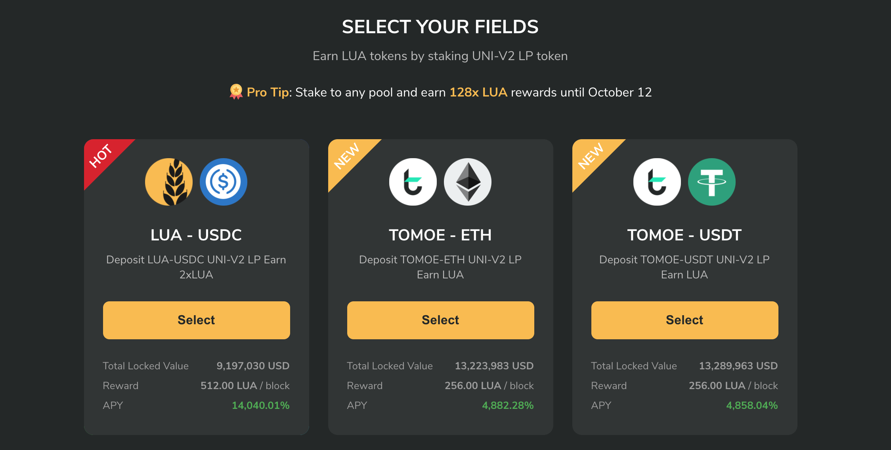
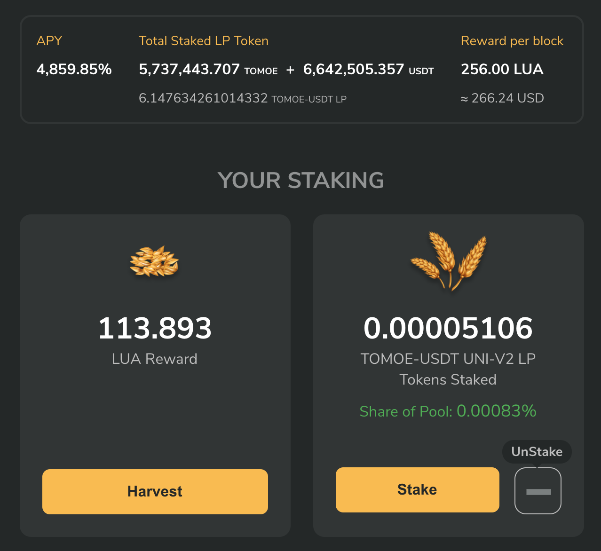
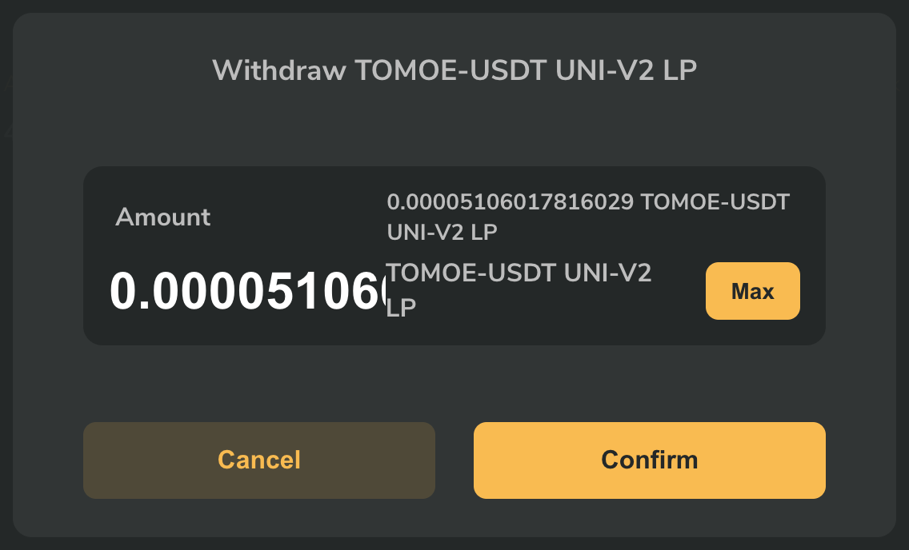

# How to stake LP token for LUA rewards

LuaSwap is a multi-chain liquidity protocol for emerging token projects with no seed investment, founder's fees, or pre-mining.

The LUA token distribution will start at block **10,950,600** on September 28 2020. 

The LUA token will only be minted and distributed to Uniswap Liquidity Providers \(LPs\) of the following pools once they also stake their LP tokens on LuaSwap \(more on this process later\):

* [**TOMOE-ETH**](https://app.uniswap.org/#/add/0x05d3606d5c81eb9b7b18530995ec9b29da05faba/ETH)
* [**TOMOE-USDT**](https://app.uniswap.org/#/add/0x05d3606d5c81eb9b7b18530995ec9b29da05faba/0xdac17f958d2ee523a2206206994597c13d831ec7)
* [**TOMOE-USDC**](https://app.uniswap.org/#/add/0x05d3606d5c81eb9b7b18530995ec9b29da05faba/0xa0b86991c6218b36c1d19d4a2e9eb0ce3606eb48)

LUA rewards are distributed every block and divided amongst all pools in the following way: 

* The LUA reward each user receives is proportional to his share in the three TOMOE pools and the LUA/USD pool \(to be launched later\). 

The LuaSwap launch phase will last for 8 weeks

* At launch, there will be a 128 times multiplier for LUA rewards during the first two weeks. Rewards are then halved every week through Week 8 until reaching the base reward level, which will be maintained thereafter. 
* 25 percent of LUA farmed until Week 8 will be released immediately, while the remaining 75 percent will have a one year vesting period. 
* Vested LUA will be released linearly every block starting approximately at Week 17. 
* After Week 8, any LUA farmed will be fully unlocked and with no vesting period.

To participate, add liquidity to any of our Uniswap pools. You’ll receive Unswap LP tokens corresponding to your share of the pool. Please follow this guide to learn more about adding liquidity to our pools on Uniswap: [this guide](https://docs.tomochain.com/tomobridge/tutorial/tomoe/how-to-add-liquidity-to-tomoe-pools-on-uniswap).  

Once you have added liquidity on Uniswap,  deposit the Uniswap LP tokens to the LuaSwap contract of the corresponding LuaSwap field using the interface at [https://luaswap.org](https://luaswap.org/).  To learn how to stake your LP tokens, read the following tutorial carefully.   
  
****Go to [https://luaswap.org](https://luaswap.org/)  
****

Select Unlock Wallet in the top-right corner and connect the wallet that has your LP tokens on Uniswap

 ****

Let’s visit the fields on LuaSwap  There are three fields at the time of writing

* [**TOMOE-ETH**](https://app.uniswap.org/#/add/0x05d3606d5c81eb9b7b18530995ec9b29da05faba/ETH)
* [**TOMOE-USDT**](https://app.uniswap.org/#/add/0x05d3606d5c81eb9b7b18530995ec9b29da05faba/0xdac17f958d2ee523a2206206994597c13d831ec7)
* [**TOMOE-USDC**](https://app.uniswap.org/#/add/0x05d3606d5c81eb9b7b18530995ec9b29da05faba/0xa0b86991c6218b36c1d19d4a2e9eb0ce3606eb48)

For each of these fields you’ll stake a different LP token. In this example, we selected the LP tokens from the Uniswap TOMOE-USDT pool

First you’ll see the total LP tokens staked in the field and the amount of LUA being rewarded per block. To stake, first  click on “Approve TOMOE-USDT UNI-V2 LP”.

Once approved you will be asked to confirm on your Metamask to grant permission to allow LuaSwap to withdraw your UNI-V2 tokens and automate transactions for you. 

Click the “Stake” button

Enter the amount of LP token you want to stake into LuaSwap. You can see your current balance of liquidity pool tokens here. Then click “Confirm”  

Once this is completed, you will see that your LP tokens have been staked, now sit back and wait for your LUA rewards to arrive.

You can harvest your LUA at any time, unstake your LP tokens, and take them back to Uniswap to retrieve your TOMOE and ETH/USDT/USDC.

### How to unstake LP token from LuaSwap

At any point, you can harvest your LUA , get your LP tokens, and take them back to Uniswap.

Go to luaswap.org and choose the field that you have staked your LP token, then click UnStake.

Enter the amount of UNI-V2 LP token you want to withdraw from LuaSwap.

Click confirm and approve that transaction on your MetmaMask. Once it approved, simply go back to Uniswap and to retrieve your tokens

### TL:DR

To receive the LUA reward, follow the steps below:

1. Swap from TOMO to TOMOE via TomoBridge \([guide](https://docs.tomochain.com/tomobridge/tutorial/tomoe/how-to-swap-your-native-tomo-on-tomochain-to-from-tomoe-erc20-on-ethereum)\)

2. Add Liquidity to our Uniswap pools \(50% TOMOE / 50% ETH/USDT/USDC\) \([guide](https://docs.tomochain.com/tomobridge/tutorial/tomoe/how-to-add-liquidity-to-tomoe-pools-on-uniswap)\)

3. Receive the Uniswap V2 LP token

4. Go to [LuaSwap](https://luaswap.org/)

5. Stake your LP token into the corresponding LuaSwap field to start receiving LUA rewards from September 28 2020.  

Remember to do your own research, and understand how Uniswap works before you start providing liquidity on Uniswap and staking your LP tokens on LuaSwap to and farming LUA. If you need any help, feel free to contact us on telegram: [https://t.me/LuaSwap](https://t.me/LuaSwap)  
  

