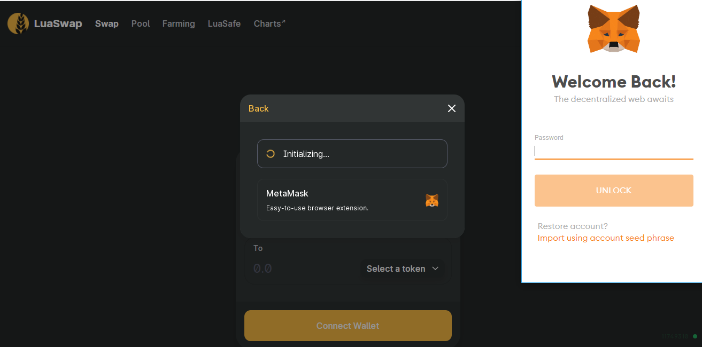

# How to swap your token on LuaSwap

**Step 1: Go to** [**https://luaswap.org**](https://luaswap.org)

  
then click on **Swap** in **Product** tab

Connect to LuaSwap via your wallet

_Note: Pls make sure to connect MetaMask to the TomoChain Network for TomoChain LuaSwap's experience_



**Step 2: Swap tokens**  
In the From section, select tokens officially listed on LuaSwap or add the contract address from the token you want to trade, then enter the amount of that token

Choose the token you want to swap to in the To section. An estimate of how many tokens you would receive after the swap will be displayed

_Note: You need to pay attention to some details including Price/ Minimum received/Price Impact/Liquidity provider fee \(0.35% of each trade\). Tx fee in the TomoChain is much lower than Ethereum \(~ 0.00003 TOMO/swap\)_

Click **Swap** to confirm the transaction 

**Step 3: Confirm the transaction**

A pop-up window would appear to confirm the gas prices to be paid for the transaction.

Input the gas prices you wish to pay then click **Confirm**

Then go to Etherscan/TomoScan to check your Tx Hash   

