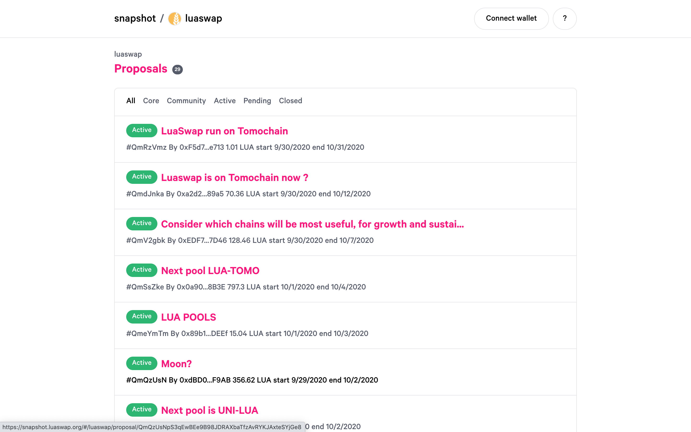
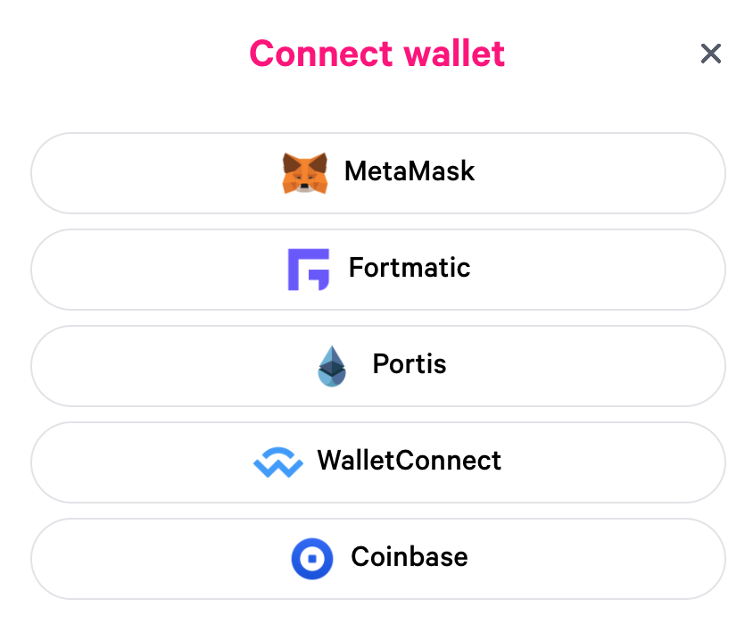
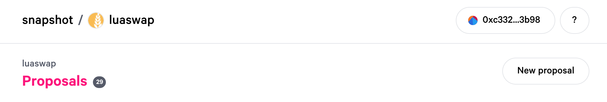
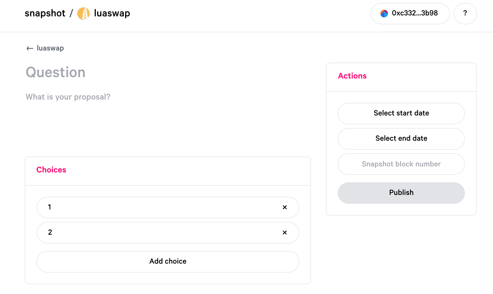
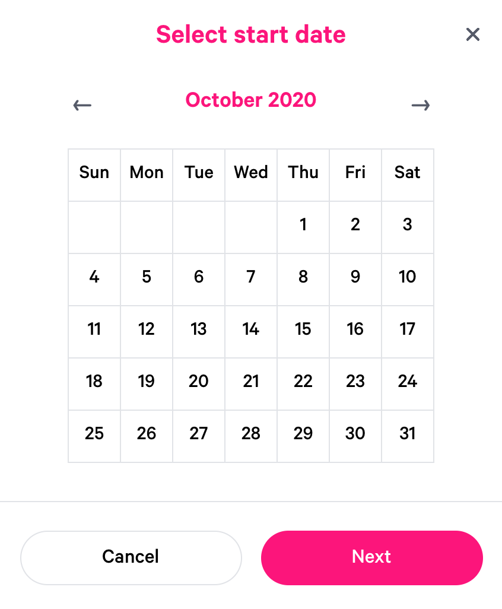
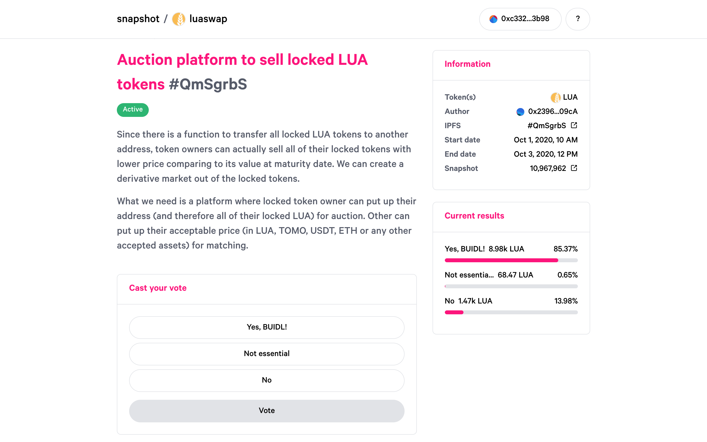
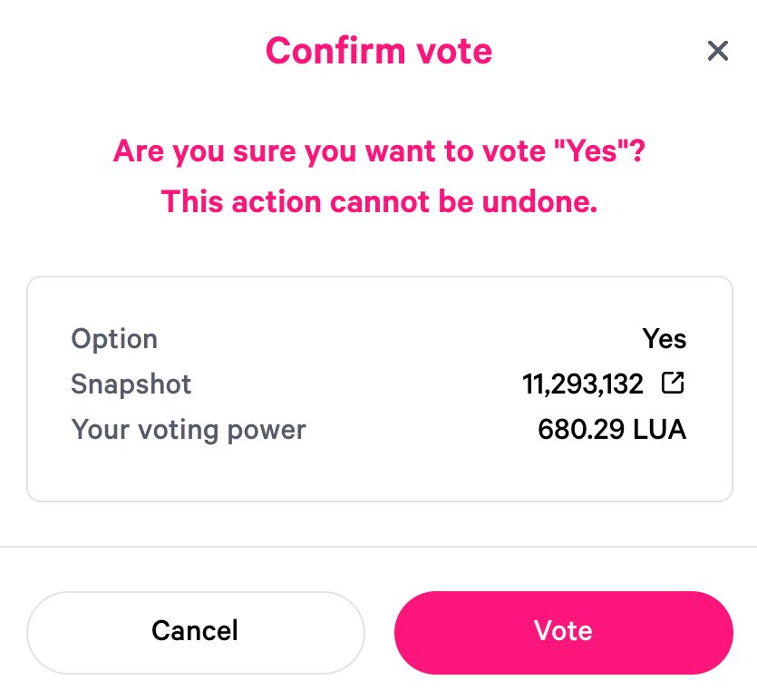
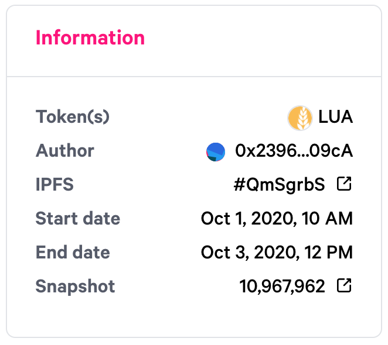

# How to use LuaSwap Snapshot for governance voting

### Create a proposal on LuaSwap Snapshot

1.Go to [https://snapshot.luaswap.org](https://snapshot.luaswap.org/#/) 

2.Click on “Connect wallet” button in top right corner 

3. Connect with wallet provider where you hold LUA token

4. Click on “New proposal” button 

5. Fill out the Title and your community proposal. Select the desired voting options

6. Select the start date/the end date

7. Fill out the Snapshot block number \([further detail below](how-to-use-luaswap-snapshot-for-governance-voting.md#snapshot-block-number)\) then choose " Publish"

### Vote on a proposal

1.Go to [https://snapshot.luaswap.org](https://snapshot.luaswap.org/#/) and make sure you connect with wallet provider where you hold relevant token

2. Choose the proposal then click on the option you want to vote for 

**Note**: A user’s voting power is based on the snapshot of unlocked LUA balance in his/her account at the snapshot block in the proposal's information page.

3. Sign the message via your wallet and done

### **Snapshot block number**

This number is important to lock the state of community members who are able to vote.

Meaning that if you attempt to vote on a proposal and block number is in the past, and you weren't holding required token yet, your vote will not be counted.

`H = h + ((t1 — t0) / a)`

Where:

* `H` = target block height
* `h` = current block height
* `t0` = current timestamp \(in seconds\)
* `t1` = target timestamp \(in seconds\)
* `a` = average time to solve a block \(in seconds\)

Or...

`last_block_number + ((future_time - time_now) / block_time)`

So, for example, using a [current epoch time](https://www.epochconverter.com) of 1481214124, the epoch time of 1482537600 for midnight Christmas Eve, and the last block of 2771338:

`2771338 + ((1482537600 - 1481214124) / 14) = 2865872`

Or just look at [etherscan.io/blocks](https://etherscan.io/blocks) and use the last block number.

Source: [Snapshot Docs](https://docs.snapshot.page/guides/create-a-proposal#snapshot-block-number)

