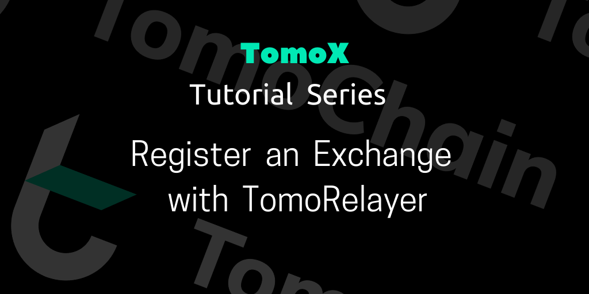

# Get Started with TomoRelayer

## **What is TomoRelayer?** 

[TomoX](https://tomochain.com/tomox/) is a secure and efficient permissionless decentralized exchange (DEX) protocol that offers the speed and experience of centralized exchanges coupled with the security of decentralization where users are always in direct custody of their funds.

[TomoRelayer](http://relayer.tomochain.com) is a portal to register and manage decentralized exchanges (also called Relayers) on TomoX. Any Relayer Owner can deposit 25,000 TOMO to claim an available DEX and then use TomoRelayer’s tools to monitor, analyze and control all digital assets

### **Key features**: 

* **Easy to Select and List TRC21 Tokens**: Selectively enable trading of any TomoChain TRC21 tokens that already applied to TomoX.
* **Professional Dashboard**: TomoRelayer provides DEX analytics that tracks key performance metrics including volume, users, and transaction count.
* **Shared Liquidity Network**: TomoX provides one giant tradable order book shared across every DEX on TomoX, allowing buyers and sellers to always find a match.

### **Dashboard** 

TAB: Relayer Page: All key figures on your Relayer’s performance.

TAB: Configuration: The specifications of your Relayer.

* **Information: **Detail information on your Relayer
* **Trade option:** Set up your Relayer’s preferred spot trading option (trading fees (%) and trading pairs)
* **Deposit**: By locking 25,000 TOMO in TomoRelayer smart contract
* **Lending: **Set up your Relayer’s preferred lending options
* **Transfer**: Transfer the ownership of your Relayer to the new owner
* **Shutdown**: Shut down your Relayer

.png>)

## **How to Register a New Relayer** 

A 25,000 TOMO deposit is required to register your relayer, which may be withdrawn later. The 25,000 TOMO deposit will be divided into 2 parts:

* Locked Funds: 20,000 TOMO will be locked and only be available for withdrawal 30 days after the relayer owner makes a decision to resign.
* Trading Fee Fund: 5,000 TOMO will be used for paying network fees, and be deducted from as fees are sent to Masternodes for handling trades and order processing.

A Relayer owner can resign the relayer position at any time. If the Trading Fee Fund is not empty, the relayer owner can withdraw the remaining funds along with the locked funds 4 weeks after resigning.

### **Step 1: Unlock your wallet** 

Select one of the available options on the home page to unlock your wallet

.png>)

### **Step 2: Relayer Registration:** 

* Deposit a minimum amount of 25,000 TOMO
* Add your Relayer coinbase’s address

.png>)

### **Step 3: Add a Name to Your Relayer** 

.png>)

### **Step 4: Set the Trading Fee**: 

Set the traders’ trading fee (The fees that traders must pay to the Relayer Owner).

* Traders’ Trading fee is adjustable
* Traders’ Trading fee is charged by Quote Token at the time that the order is matched and sent to Relayer Owner Address.

E.g: Pair TOMO/USDT

TOMO -> Base Token

USDT -> Quote Token

\=> The trading fee will be charged by USDT.

.png>)

### **Step 5: Select trading pairs and lending pair (optional)** 

.png>)

### **Step 6: Review and Publish** 

Please carefully review the pop-up box which includes all details and settings of your Relayer before publishing your own decentralized exchange.

.png>)

Congratulations, you’ve just created your very own Relayer. We are excited to see how you experience TomoRelayer, and how big and successful your DEX is going to grow.

### Video Tutorial



Seek more support at [TomoX support group](https://t.me/tomox).
