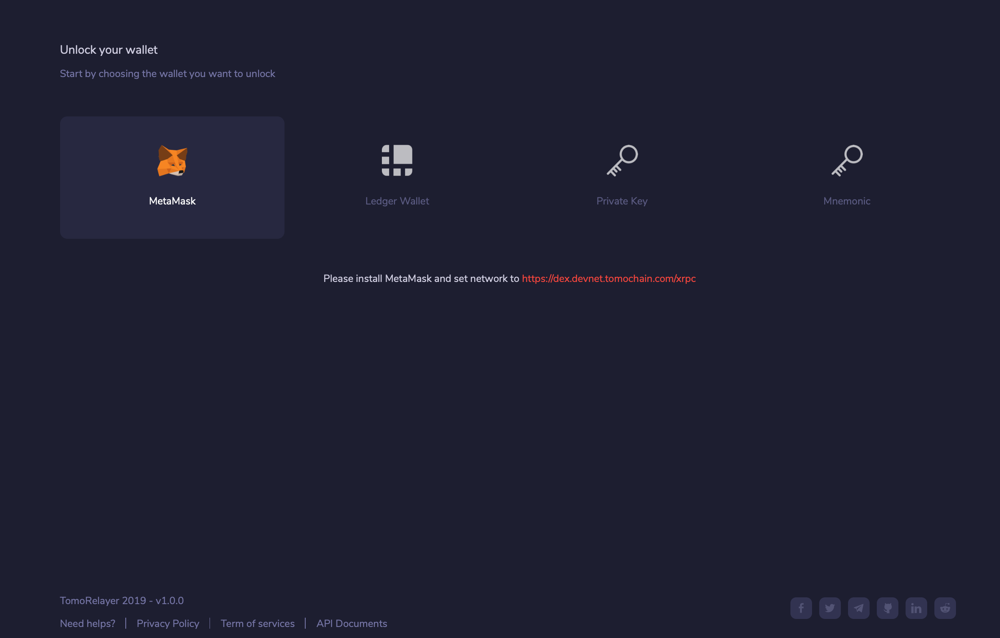
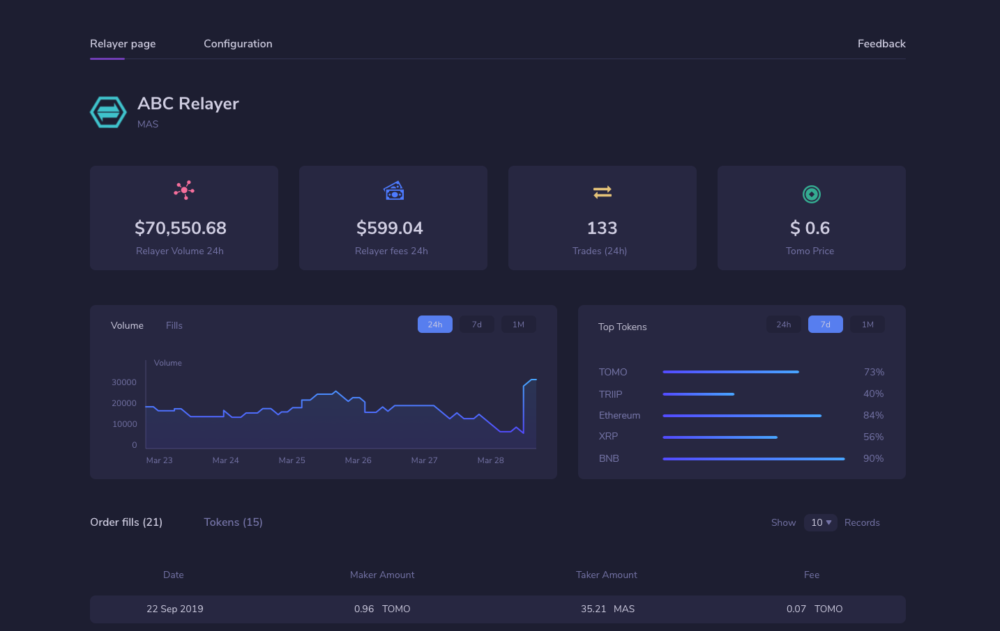

# Get Started with TomoRelayer

## **What is TomoRelayer?** 

[TomoRelayer](https://relayer.testnet.tomochain.com/login) is a Decentralized Exchange portal which follows TomoChain’s design and interacts with the underlying TomoX protocol. By using TomoRelayer, anyone can propose their own decentralized exchange by depositing 25,000 TOMO. The design used in TomoRelayer assists the owners in monitoring, analyzing and controlling digital assets on their exchange platform with a professional dashboard.

The following are some key features of TomoRelayer that can help and attract more people towards using DEXs in the future.

* **Interoperability:** Enabling trading of any TRC-20 or TRC-21 asset, any token that follows these standards can be traded on TomoX-integrated DEX.
* **Professional Dashboard**: Providing an information management UI that tracks the key performance of your DEX.
* **Liquidity Network**: Providing one giant tradable order book for every token. Whether you’re trading on the most popular exchange or the least popular exchange, the token order book will always be the same.

## **Let’s get started** 

### **Step 1: Unlocking your wallet** 

On the [homepage](https://relayer.testnet.tomochain.com/login), you will see 4 options to unlock your wallet

### **Step 2: Once unlocked, you will see the display of the main Dashboard** 

The main dashboard displays 2 main tabs

* **Relayer Page:** Displays all key figures representing your Relayer’s performance.
* **Configuration:** this advanced tab can override the content and default settings, including:
* **Information:** Setting detailed information of the Relayer
* **Trade option:** Adding trading fees \(%\) and trade tokens based on preference
* **Transfer:** Transfer ownership of the Relayer to the new owner
* **Shutdown:** Shut down the Relayer

## **Steps on registering a new Relayer** 

**Step 1**: Relayer Registration: Firstly, deposit a minimum amount of 25,000 TOMO and add an address of the Relayer coinbase

**Step 2:** Add the Relayer's Name

**Step 3:** Adjust the trading Fee: the Brokerage fee is charged when a trader buys or sells tokens. The minimum requirement is 0.01% and it can be modified later

**Step 4:** Select trading pairs to appear in the Main Dashboard. Volume information will appear within 7 days.

Once completing all 4 steps, there will be a review box about all previous details and settings before officially publishing the Relayer.

Congratulations, you’ve just created your very own Relayer.

### Fill in this [**FORM**](https://docs.google.com/forms/d/1Zi4Kf6inNka0B7e9sFjoTpv47Khe_khJ6Hel3NQEMfU/viewform?edit_requested=true) to receive 25,001 TOMO testnet to register your own DEX. 

Seek more support at [TomoX support group](https://t.me/tomox).

