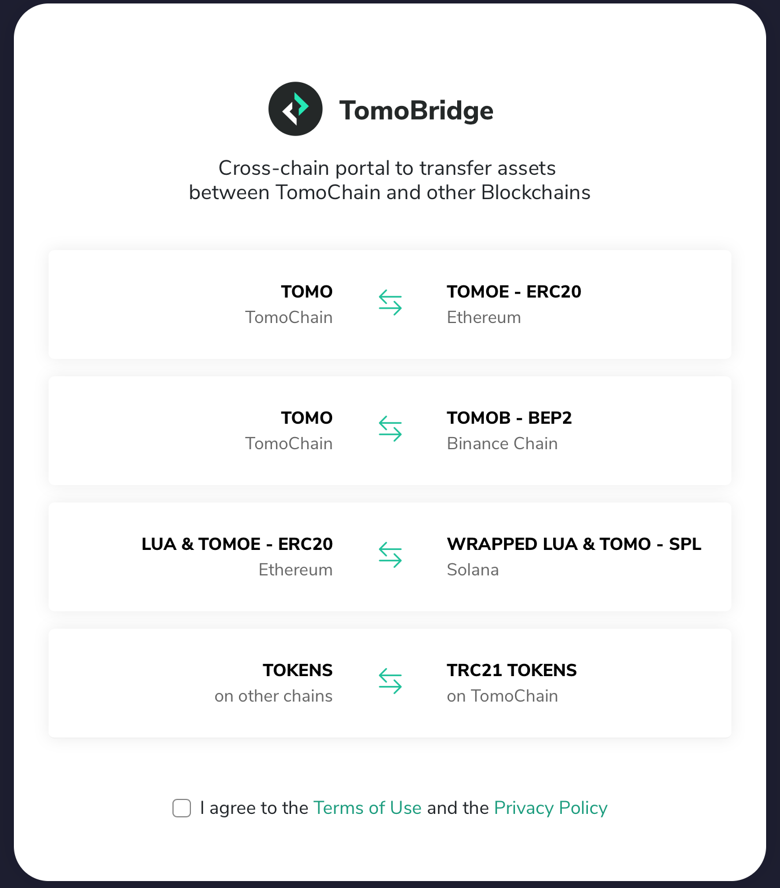
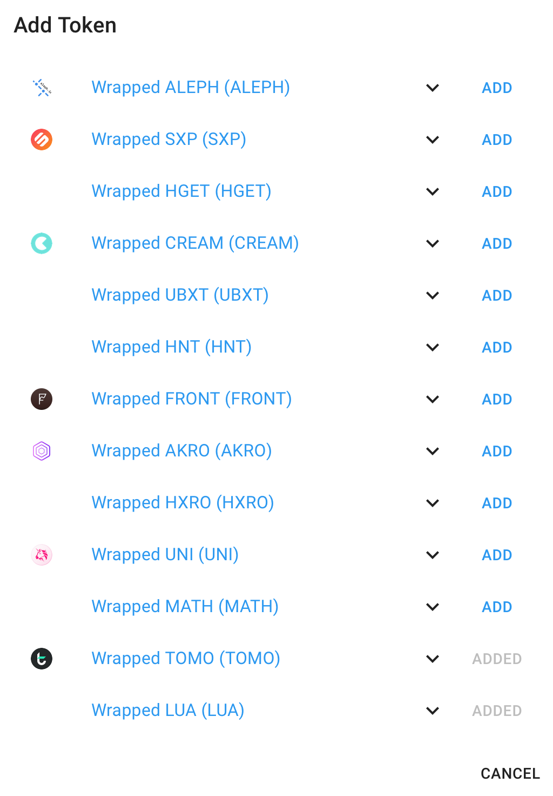

# TOMO Wrapped Token on Solana

#### How to convert TOMOE & LUA \(ERC20\) to Wrapped TOMOE & LUA \(SPL\) token on Solana

Go to bridge.tomochain.com then choose LUA&TOMO wrapped token on Solana

Users can convert back and forth between TOMOE and  Wrapped TOMOE on Solana at any time via Sollet wallet. 

Create TOMOE & LUA wrapped token address on Sollet.io

Go to sollet.io

If this is the first time using Sollet, follow the instruction on [Create your SOL wallet](https://serum-academy.com/en/serum-dex/sol-wallet/)  to create and fund your wallet with SOL. You can easily buy SOL on several exchanges like FTX or Binance.

Note: The Token Address is the token’s contract address, do not send tokens to this address. The Deposit Address is the address where you deposit a token to.  

Add TOMOE and LUA 

Now that you have some SOL in your wallet, you can create another SPL address in your wallet. To add another address, click on the + icon in the top right corner. You can deposit TOMOE & LUA tokens and convert them to SPL tokens using the convert function of [Sollet.io](https://sollet.io/) and Metamask. 

Click on ERC20 tab and find TOMO/LUA wrapped token on dropdown menu

Done, now you can start converting TOMOE/LUA to SPL token

Convert TOMOE & LUA into SPL token

Once you have successfully created TOMOE & LUA address, the next step is to convert your TOMOE & LUA \(ERC20\) to wrapped token on Solana

Choosing TOMOE/LUA on the list Sollet.io token addresses, click on the dropdown menu on the right side, then click “Receive.”

A pop up will appear. Please enter the amount of TOMOE/LUA you want to convert to SPL wrapped tokens. 

Approve your transaction on MetaMask and wait for confirmation. 

Swapping TOMOE to wrapped TOMOE on Solana takes up 12 Ethereum blocks.  

Done! You have successfully swapped TOMOE/LUA to wrapped tokens on Solana. TOMOE/LUA has been transferred to your SPL address, and now it’s time to trade.   

Convert TOMOE & LUA wrapped token to ERC20 token

Swapping TOMOE/LUA wrapped token to ERC20 is similar to swapping TOMOE/LUA to SPL token on Solana. 

Go to sollet.io and choosing TOMOE/LUA on the list Sollet.io token addresses, click on the dropdown menu on the right side, then click “Send”  

On ERC20 TOMOE tab, fill in all required information, including the recipient address to receive TOMOE/LUA & the desired amount then click “Send”.

Wait for the system to verify your transaction. Swapping TOMOE/LUA  wrapped token to ERC20 token takes up 35 Solana blocks.

TOMOE/LUA ERC20 has been transferred to your address on Ethereum network, you can double check the transaction detail on Etherscan.

