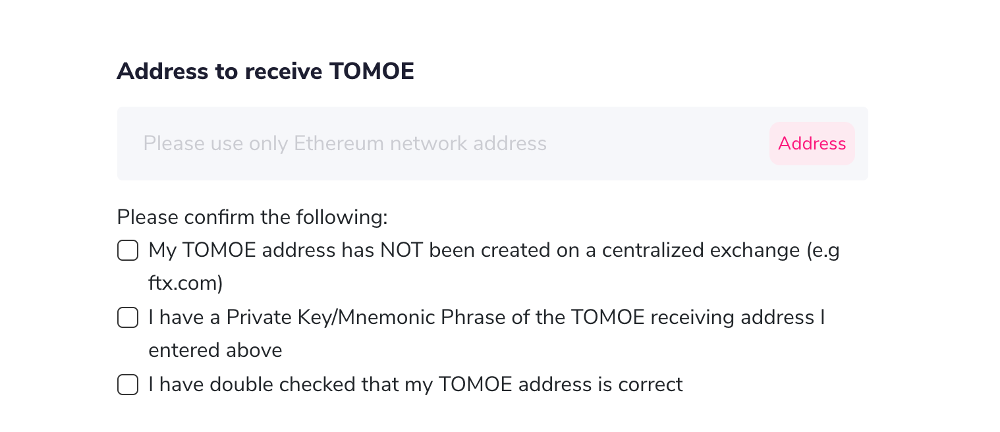
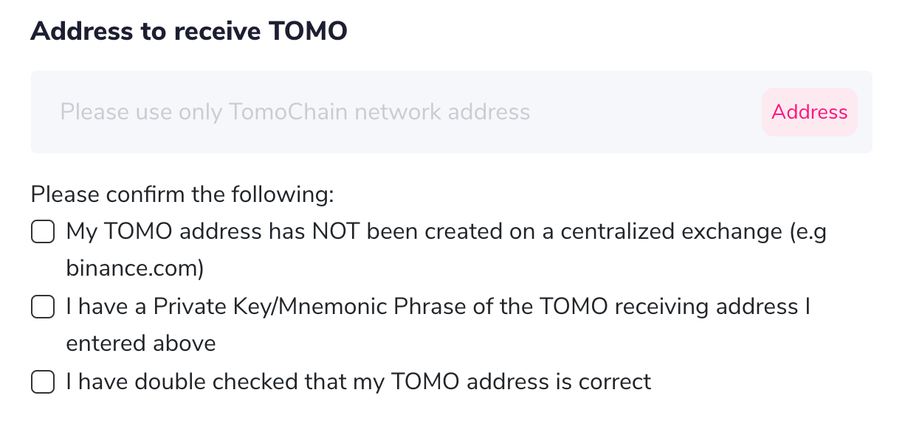

# How to swap your native TOMO on TomoChain to/from TOMOE (ERC20) on Ethereum

### Please follow our instructions to swap your native TOMO on TomoChain to TOMOE on Ethereum and vice versa.&#x20;

We are excited to introduce a new version of TomoBridge v1.1.0 to swap between native TOMO and TOMOE (ERC20).&#x20;

To simplify the process for users, please follow the detailed tutorial on how to swap your tokens on TomoBridge.\

* What is TOMOE?

TOMOE is an ERC20 token hosted on the Ethereum blockchain (contract address: 0x05d3606d5c81eb9b7b18530995ec9b29da05faba) and backed by an equal amount of native TOMO (on the TomoChain blockchain). One TOMOE is worth the same as one native TOMO at any given moment. \

Users can convert back and forth between TOMO and TOMOE at any time via TomoBridge. The proof of reserve is on-chain, which shows the exact 1:1 between minted TOMOE and native TOMO stored by TomoBridge. When TOMOE is redeemed for TOMO, it will be burned. The minting and burning of TOMOE are tracked and verifiable via a smart contract on TomoScan/Etherscan.\

## How to swap TOMO to TOMOE

### Step 1: Go to bridge.tomochain.com 

Log into your Metamask account. Switch the network to TomoChain.&#x20;

Note: if this is your first time switching to the TomoChain network on Metamask you will need to set it up initially. Follow [this guide](https://docs.tomochain.com/general/how-to-connect-to-tomochain-network/metamask) to enable the TomoChain network on Metamask. \

### Step 2: Make sure to double-check the correct information on swapping from TOMO to TOMOE.&#x20;

* Fill in all required information, including the Ethereum address to receive TOMOE & the desired amount. (Minimum amount to swap: 100 TOMO)&#x20;

\*\* Make sure you own a private key/seeding phrase and can access the Ethereum address receiving TOMOE. \

* Click “Swap" once you've filled all information.&#x20;

### Step 3: Wait for the system to verify your transaction.&#x20;

Swapping TOMO to TOMOE takes up 30 TomoChain blocks, which falls within 1-2 minutes. \

### Step 4: You have successfully swapped TOMO to TOMOE. TOMOE has been transferred to the Ethereum address specified. 

\_\_\_\_\_\_\_\_\_\_\

## How to add TOMOE token into your Metamask&#x20;

### Step 1: Open Metamask with your logged in account. Click “Add Token". Make sure your network is on Main Ethereum Network. 

### Step 2: Click on “Custom Token" & Fill in the following information:&#x20;

* Contact address: 0x05d3606d5c81eb9b7b18530995ec9b29da05faba
* Token Symbol: TOMOE
* Decimal: 18&#x20;

Click “Next" \

### Step 3: You've successfully added TOMOE into your Metamask wallet. Your TOMOE balance should be displayed like follow. 

\_\_\_ \

## How to swap TOMOE to TOMO

Swapping TOMOE to TOMO is similar to swapping TOMO to TOMOE, with some minor changes in setting up the network on Metamask. \

### Step 1: Go to bridge.tomochain.com and log into your Metamask Account. Switch the network to Ethereum. 

Note: TOMOE can only be swapped to TOMO when the network is set up on the Main Ethereum Network.

### Step 2: Make sure to double-check the correct information on swapping from TOMOE to TOMO.&#x20;

* Fill in all required information, including the TOMO address to receive TOMO & the desired amount.

* **Note: **Please make sure that you have the private key/memoric phrase for the TOMOE receiving address you entered above. Do NOT use your centralized exchange address (Binance, Kucoin, etc).

### Step 3: Wait for the system to verify your transaction.&#x20;

Swapping TOMOE to TOMO takes 6 Ethereum blocks, which falls within 2-3 minutes. \

### Step 4: You have successfully swapped TOMOE to TOMO. TOMO has been transferred to the TomoChain address specified. 

\_\_\_ \

* Network Fees&#x20;

Network fees vary between swapping TOMO & TOMOE.&#x20;

* Swap TOMOE-TOMO: 0 TOMO
* Swap TOMO-TOMOE: 4 TOMO with a minimum Swap amount of 100 TOMO.

\*\* The amount of 4 TOMO is an internal fee that will be deducted directly within your swapping amount. For example, if you enter 500 TOMO to be swapped, 4 TOMO will be taken, and you will receive 496 TOMO in TOMOE.\*\* \

That’s it! You have gone through the whole process of swapping between TOMO & TOMOE on TomoBridge. If you have any questions, feel free to contact us via: admin@tomochain.com \
\
