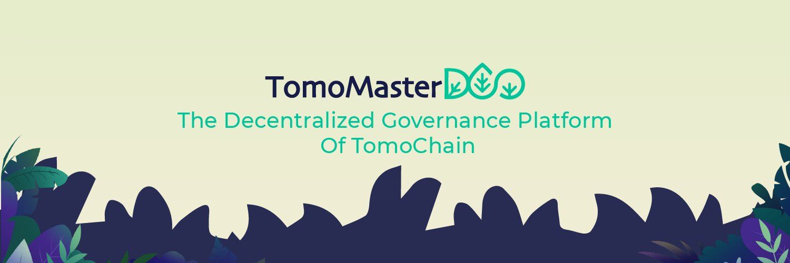

# Introduction

<figure><figcaption></figcaption></figure>

The cryptocurrency space continues to push forward with new solutions to revolutionize the financial industry. The key philosophy is the distribution of power back to the people, and the ability to have real influence and change over the future direction of a given project. The trustless model of a distributed ledger allows the community to run the network and removes the need for a central authority to wield the power. The network and its members are able to make decisions through a governance system known as a _**Decentralised Autonomous Organisation (DAO).**_&#x20;

DAO’s are predominantly used for network changes and governance over a project’s treasury. DAO’s have come into the limelight with the prolific rise of Decentralised Finance (DeFi). Many protocols have launched a token to govern the network, as well as fund developers and community initiatives through its treasury.&#x20;

DAO’s offer a high level of transparency and power to the user, but this does not come without tradeoffs. There is the potential for security risks in the form of smart contract bugs, and the potential implications of leaving important financial decisions in the hands of the masses.&#x20;

[TomoMasterDAO](https://master.tomochain.com/) aims to address these issues to create a spirited community that can build strength in the TomoChain network.&#x20;
