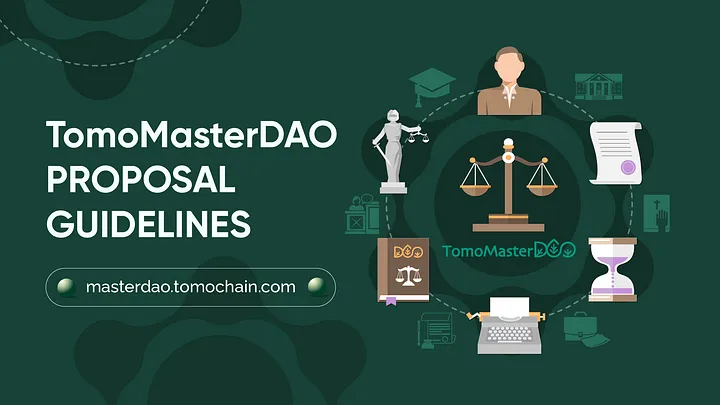

# Proposal guidelines for TomoMasterDAO

TomoMasterDAO gives you the opportunity to explore, experiment, and innovate in the world of web3 and blockchain. We believe in order to develop the financial and social tools of the future, contributions to projects in their early stage is a fundamental component. We have built a platform to offer grants decided by the community, for projects looking to innovate with the TomoChain ecosystem.

<figure><figcaption></figcaption></figure>

## Proposal Scope 

TomoMasterDAO offers a wide variety of grants in different fields of interest. You can apply for funding for marketing activities, educational tools, building software, launching new tokens, etc. A few examples of topics are:

● Decentralized Finance

● Gaming and NFTs

● Metaverse

● Privacy technology

● Token bridges

● Research and development

● Educational activities and tools

● Marketing campaigns

● E-commerce

● Travel and transportation

● Medical technology

● Supply chain management

In order to qualify for funding, the project must be relevant to the TomoChain ecosystem. This can be through directly building on the network, creating tools that can be used with the network, integration of an existing product, or promoting/educating with a focus on TomoChain.

## Applying for a Grant 

The first step in applying for a grant is to post a summary of your proposal idea on the [Forum](https://forum.tomochain.com/c/tomomasterdao/35.). This will allow you to discuss your ideas with the community, answer any questions, and make the community aware before any proposal goes live on the governance portal. Include “Proposal Discussion”, then your proposal title, then a summary of your proposal and requested funding. Please use the format displayed in the following example:

> Proposal Discussion — TomoWarrior NFT Series
>
> Crypto Labs is proposing to build…

The next step is submitting a proposal to the TomoMasterDAO Board through the [governance portal](https://masterdao.tomochain.com/). You can also use the link [here ](https://forms.gle/uHhXxzVfmXn98hwz8)to submit your own proposal, which will be routinely checked and picked up by the Board . The Board is made up of 3 internal TomoChain Lab Members, and 4 external members elected by the community. The Board will assess your proposal on these criteria:

● Legitimacy and experience of the team or organization

● Analysis of the proposal idea

● Relevancy to the TomoChain network

● Amount of funding requested

Grant rounds are conducted every three months with \~50,000 TOMO of funding allocated for each round. Depending on the funding available for the rest of the grant round, the TomoMasterDAO Board may request that you reduce your funding, split your proposal into multiple rounds, or request you to wait until the next grant round.

In the case of the funding requested is less than $1,000 equivalent USD, the Board will make a decision based upon the above criteria and funding can be directly allocated to the project. If the funding requested is more than $1,000 equivalent USD, the proposal will be put for a vote by the TomoMasterDAO community if the proposal is approved by the Board.

In the case that the TomoMasterDAO Board rejects a proposal, reasoning will be given to the project along with feedback on the proposal. The project may resubmit the proposal after consideration of the recommendations.

## Submission Requirements 

To give your proposal the highest chance of being approved it is critical that you submit all the required information and give enough detail for your proposal. Here are the requirements:

● Proof of community engagement through Telegram or the Forum.

● A summary of your proposal

● Full details of work required to complete your proposal

● Milestones required for completion along with a timeline

● Information on your team including any past work or ongoing projects

● Requested funding

You can use this link [here ](https://forms.gle/uHhXxzVfmXn98hwz8) to submit an official proposal or you can email a draft document to _tomomasterdao@tomochain.com_ or _lak@tomochain.com_.

_Note that proposals will be rejected if the above criteria are not submitted. If you have a proposal but not a team, please head over to Discord to discuss your options._

## Allocation of Funding 

All funding for the initial stages of TomoMasterDAO will be allocated in TOMO. Depending on the size of the funding requested there will be a different process for a project to receive funds.

### Proposals < $1000 USD Equivalent 

Funding requested for less than a $1,000 USD equivalent can be allocated directly in full to the project after being reviewed by the Board.

### Proposals > $1000 USD Equivalent 

For a proposal that passes the community vote above $1,000 USD equivalent, funding will be allocated in two phases. Initially, 50% of the requested funding will be sent to the desired address within 7 days of the conclusion of the proposal. The TomoMasterDAO Board will be in contact with the project to track progress. Once the project has achieved its milestones and the TomoMasterDAO Board has verified these, the remainder of the funding will be sent to the project.

### Special Cases 

Special cases of funding outside the set guidelines will be determined on a case-by-case basis. If a project is requesting <$5000 USD equivalent they have the option to apply for 100% allocation of the grant at the conclusion of the proposal as long as they provide sufficient reasoning and transparency of use of funds. The default will be the two-phase allocation.

If a project fails to reach the milestones it set out to achieve, they have the option to apply for the remainder of the grant. Sufficient reasoning along with a formal report is required so the TomoMasterDAO Board can review the project. The TomoMasterDAO Board will make the decision and inform the community and project team about the results.
